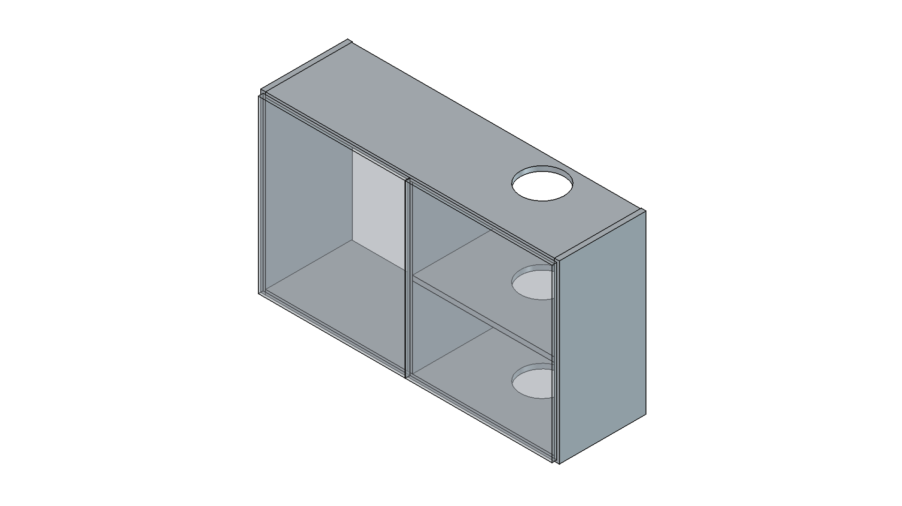
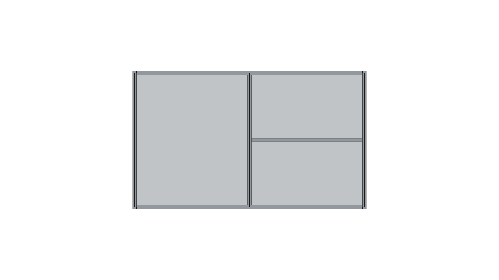
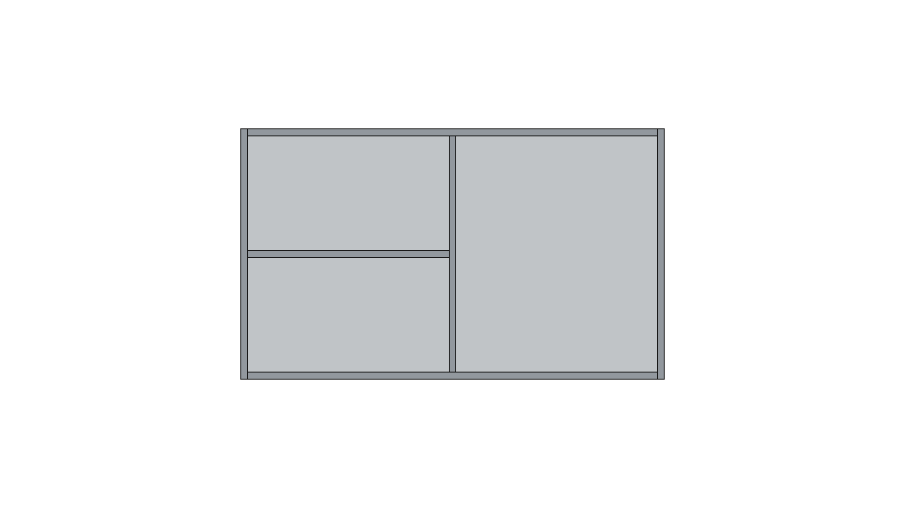
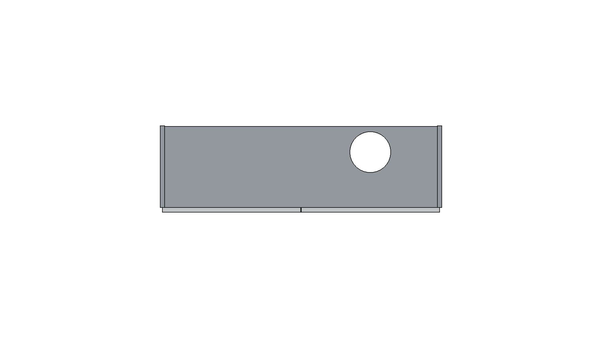
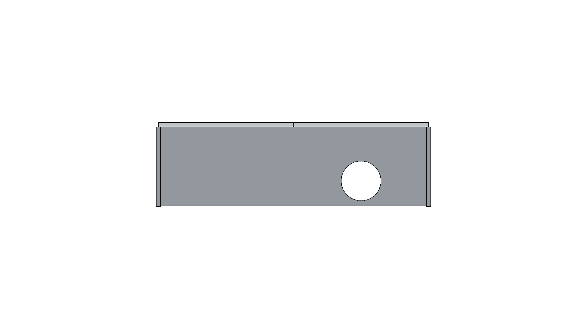

# Manual Constructivo - Mueble AA

**Módulo:** Alacena A (Superior Izquierda)
**Código:** AA
**Terminación:** Melamina blanca
**Espesor estándar:** 18 mm

## Vistas del Mueble
<figure style="display:inline-block; width:48%; margin:0 1% 12px 0;"><figcaption style="font-size:11px">Isométrica</figcaption></figure>
<figure style="display:inline-block; width:48%; margin:0 1% 12px 0;"><figcaption style="font-size:11px">Frente</figcaption></figure>
<figure style="display:inline-block; width:48%; margin:0 1% 12px 0;"><figcaption style="font-size:11px">Posterior</figcaption></figure>
<figure style="display:inline-block; width:48%; margin:0 1% 12px 0;"><figcaption style="font-size:11px">Lateral Izquierdo</figcaption></figure>
<figure style="display:inline-block; width:48%; margin:0 1% 12px 0;"><figcaption style="font-size:11px">Lateral Derecho</figcaption></figure>
<figure style="display:inline-block; width:48%; margin:0 1% 12px 0;"><figcaption style="font-size:11px">Superior</figcaption></figure>
<figure style="display:inline-block; width:48%; margin:0 1% 12px 0;"><figcaption style="font-size:11px">Inferior</figcaption></figure>

## Detalle de Cortes
| Código | Categoría | Pieza | Cant. | Largo (mm) | Ancho (mm) | Espesor (mm) | Cantos |
|---|---|---:|---:|---:|---:|---:|---|
| AA1 | Lateral | Lateral_Izq | 1 | 614.0 | 320.0 | 18.0 | Canto frente |
| AA2 | Lateral | Lateral_Der | 1 | 614.0 | 320.0 | 18.0 | Canto frente |
| AA3 | Horizontal | Piso_Casco_Calado160 | 1 | 1050.0 | 320.0 | 18.0 | Canto frente |
| AA4 | Horizontal | Tapa_Casco_Calado160 | 1 | 1050.0 | 320.0 | 18.0 | Canto frente |
| AA5 | Vertical | Divisor_Central | 1 | 614.0 | 317.0 | 18.0 | Canto frente |
| AA6 | Horizontal | Estante_Derecho_Calado160 | 1 | 498.0 | 317.0 | 18.0 | Canto frente |
| AA7 | Fondo | Fondo_3mm | 1 | 1014.0 | 614.0 | 3.0 | Sin canto |
| AA8 | Frente | Puerta_Izquierda | 1 | 515.0 | 632.0 | 18.0 | 4 cantos |
| AA9 | Frente | Puerta_Derecha | 1 | 515.0 | 632.0 | 18.0 | 4 cantos |

## Instrucciones de Ensamblado
# Alacena A (AA) - superior izquierda

## Parametros usados
- Espesor melamina: 18 mm
- Fondo: 3 mm
- Ancho exterior: 1050 mm
- Profundidad exterior: 320 mm
- Alto del mueble: 650 mm
- Piso y tapa pasantes (laterales entre piso y tapa)
- Interior dividido en 2 mitades iguales por divisor vertical central
- Estante solo en lado derecho, a media altura
- 2 puertas iguales (apertura desde centro hacia izquierda y derecha)
- Calado para ducto extractor: diametro 160 mm
- Eje de calado centrado en modulo derecho y a 20 mm del fondo
- El calado atraviesa piso, estante derecho y tapa

## Instalacion recomendada (respecto a cocina)
- Mesada: 900 mm
- Techo: 2300 mm
- Colocacion sugerida: base de alacena a 1650 mm
- Con eso, la alacena llega al techo (1650 + 650 = 2300)

## Codigos de piezas (prefijo AA)
- AA1: lateral izquierdo
- AA2: lateral derecho
- AA3: piso casco (calado 160)
- AA4: tapa casco (calado 160)
- AA5: divisor central
- AA6: estante derecho
- AA7: fondo 3 mm
- AA8: puerta izquierda
- AA9: puerta derecha

## Herrajes sugeridos
- 4 bisagras cazoleta 35 mm (2 por puerta)
- 1 tirador por puerta
- Colgadores de alacena o escuadras segun sistema de fijacion
- Tornillos para melamina (confirmat 5x50 o equivalente)
- Soportes de estante

## Secuencia de armado
1. Cortar y cantear piezas segun BOM.
2. Armar casco: laterales + piso + techo.
3. Colocar divisor central y luego estante derecho a media altura.
4. Fijar fondo de 3 mm escuadrando el mueble.
5. Colocar puertas AA8 y AA9, regular bisagras y dejar luz central de 2 mm.
6. Ejecutar calado de 160 mm en piso/techo antes de montaje final en pared.

## Nota tecnica
- El fondo se deja oculto en las capturas para mantener limpieza visual del modelo.
- Si queres cambiar altura de colgado, modificar la cota de instalacion; el mueble sigue midiendo 650 mm.
