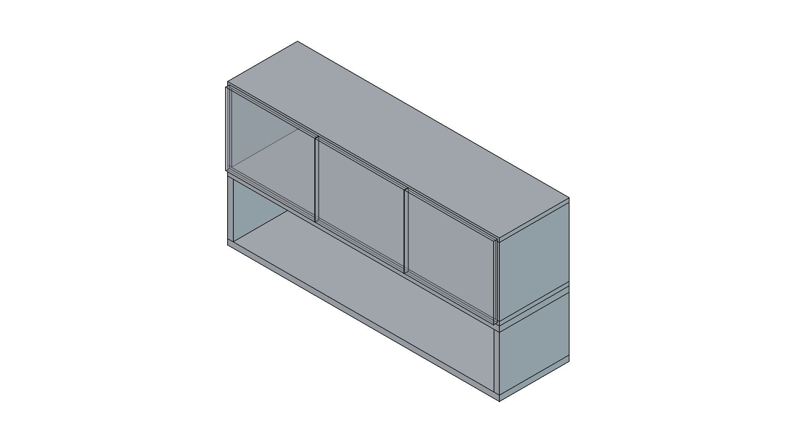
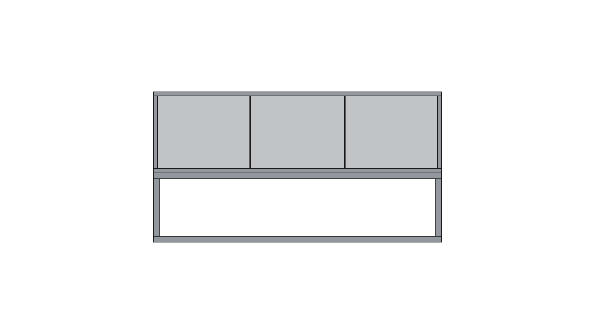
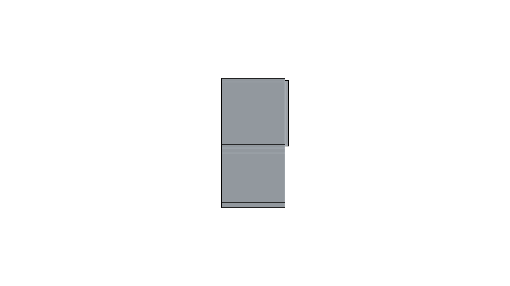
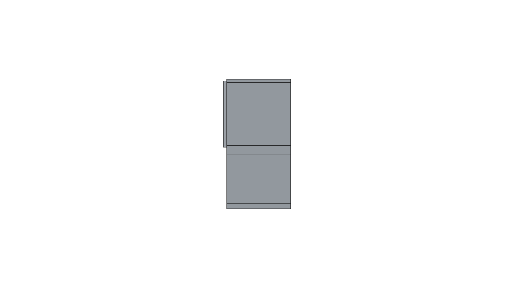
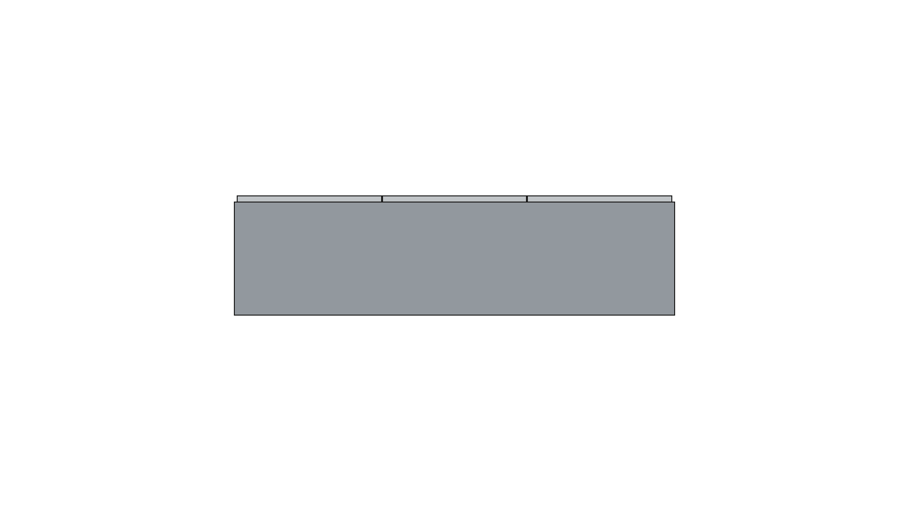

# Manual Constructivo - Mueble AB+AC

**Módulo:** Conjunto Derecho: Alacena AB + Cajon AC
**Código:** AB+AC
**Terminación:** AB: melamina blanca / AC: melamina paraiso
**Espesor estándar:** 18 mm

## Vistas del Mueble
<figure style="display:inline-block; width:48%; margin:0 1% 12px 0;"><figcaption style="font-size:11px">Isométrica</figcaption></figure>
<figure style="display:inline-block; width:48%; margin:0 1% 12px 0;"><figcaption style="font-size:11px">Frente</figcaption></figure>
<figure style="display:inline-block; width:48%; margin:0 1% 12px 0;"><figcaption style="font-size:11px">Posterior</figcaption></figure>
<figure style="display:inline-block; width:48%; margin:0 1% 12px 0;"><figcaption style="font-size:11px">Lateral Izquierdo</figcaption></figure>
<figure style="display:inline-block; width:48%; margin:0 1% 12px 0;"><figcaption style="font-size:11px">Lateral Derecho</figcaption></figure>
<figure style="display:inline-block; width:48%; margin:0 1% 12px 0;"><figcaption style="font-size:11px">Superior</figcaption></figure>
<figure style="display:inline-block; width:48%; margin:0 1% 12px 0;"><figcaption style="font-size:11px">Inferior</figcaption></figure>

## Detalle de Cortes
| Código | Categoría | Pieza | Cant. | Largo (mm) | Ancho (mm) | Espesor (mm) | Cantos |
|---|---|---:|---:|---:|---:|---:|---|
| AC1 | AC_Paraiso | AC_Lateral_Izq | 1 | 249.2 | 320.0 | 25.4 | Canto frente |
| AC2 | AC_Paraiso | AC_Lateral_Der | 1 | 249.2 | 320.0 | 25.4 | Canto frente |
| AC3 | AC_Paraiso | AC_Piso | 1 | 1244.0 | 320.0 | 25.4 | Canto frente |
| AC4 | AC_Paraiso | AC_Tapa | 1 | 1244.0 | 320.0 | 25.4 | Canto frente |
| AB1 | AB_Blanco | AB_Lateral_Izq | 1 | 314.0 | 320.0 | 18.0 | Canto frente |
| AB2 | AB_Blanco | AB_Lateral_Der | 1 | 314.0 | 320.0 | 18.0 | Canto frente |
| AB3 | AB_Blanco | AB_Piso | 1 | 1244.0 | 320.0 | 18.0 | Canto frente |
| AB4 | AB_Blanco | AB_Tapa | 1 | 1244.0 | 320.0 | 18.0 | Canto frente |
| AB5 | AB_Blanco | AB_Fondo_3mm | 1 | 1208.0 | 314.0 | 3.0 | Sin canto |
| AB6 | Frente | AB_Puerta_1 | 1 | 407.3333333333333 | 332.0 | 18.0 | 4 cantos |
| AB7 | Frente | AB_Puerta_2 | 1 | 407.3333333333333 | 332.0 | 18.0 | 4 cantos |
| AB8 | Frente | AB_Puerta_3 | 1 | 407.3333333333333 | 332.0 | 18.0 | 4 cantos |

## Instrucciones de Ensamblado
# Conjunto Derecho - AB + AC

## Parametros usados
- Espesor melamina AB: 18 mm
- Espesor melamina AC (paraiso): 25.4 mm (1 pulgada)
- Fondo AB: 3 mm (oculto en vistas)
- Ancho exterior total AB: 1244 mm
- Profundidad: 320 mm
- AC (paraiso): alto 300 mm
- AB (blanco): alto 350 mm
- Altura total AB+AC: 650 mm
- AB con 3 puertas iguales y equidistantes

## Configuracion AC
- AC es un cajon completo de melamina paraiso 25.4 mm
- Piso y tapa pasantes (laterales entre ambos)
- Incluye piso y tapa
- El piso de AC coincide en altura con el piso de A1 al montar en cocina

## Configuracion AB
- Sin estantes
- Sin divisores internos (espacio horizontal libre)
- Tres puertas iguales y equidistantes
- Piso y tapa pasantes (laterales entre ambos)

## Codigos de piezas
- AC1: AC lateral izq
- AC2: AC lateral der
- AC3: AC piso
- AC4: AC tapa
- AB1: AB lateral izq
- AB2: AB lateral der
- AB3: AB piso
- AB4: AB tapa
- AB5: AB fondo 3 mm
- AB6: AB puerta 1
- AB7: AB puerta 2
- AB8: AB puerta 3

## Secuencia de armado
1. Armar AC (paraiso): laterales + piso + tapa.
2. Armar AB (blanco): laterales + piso + tapa.
3. Fijar fondo 3 mm de AB para escuadra.
4. Montar AB sobre AC.
5. Colocar puertas AB6, AB7 y AB8 y regular luces.
