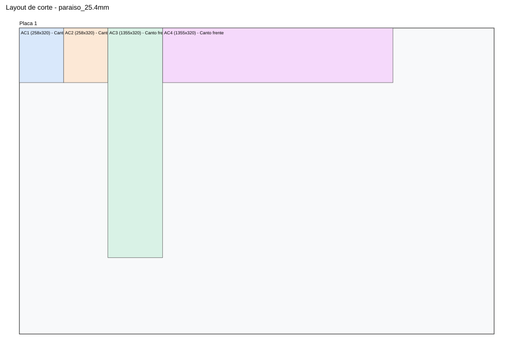

# Manual Constructivo Integral - Cocina

## 1. Vista general del ensamble
<figure style="display:inline-block; width:96%; margin:0 1% 10px 0;"><figcaption style="font-size:9pt">Ensamble general (isometrica)</figcaption></figure>

## 2. Lista unica total de partes
| Categoria | Pieza | Cant total | Largo | Ancho | Espesor | Cantos | Modulos | ML gola | Bisagras |
| --- | --- | --- | --- | --- | --- | --- | --- | --- | --- |
| AB_Blanco | AB_Fondo_3mm | 1 | 1319.0 | 455.0 | 3.0 | Sin canto | AB |  |  |
| AB_Blanco | AB_Lateral_Der | 1 | 455.0 | 320.0 | 18.0 | Canto frente | AB |  |  |
| AB_Blanco | AB_Lateral_Izq | 1 | 455.0 | 320.0 | 18.0 | Canto frente | AB |  |  |
| AB_Blanco | AB_Piso | 1 | 1355.0 | 320.0 | 18.0 | Canto frente | AB |  |  |
| AB_Blanco | AB_Tapa | 1 | 1355.0 | 320.0 | 18.0 | Canto frente | AB |  |  |
| AC_Paraiso | AC_Fondo_18mm | 1 | 1304.2 | 258.2 | 18.0 | Sin canto | AB |  |  |
| AC_Paraiso | AC_Lateral_Der | 1 | 258.2 | 320.0 | 25.4 | Canto frente | AB |  |  |
| AC_Paraiso | AC_Lateral_Izq | 1 | 258.2 | 320.0 | 25.4 | Canto frente | AB |  |  |
| AC_Paraiso | AC_Piso | 1 | 1355.0 | 320.0 | 25.4 | Canto frente | AB |  |  |
| AC_Paraiso | AC_Tapa | 1 | 1355.0 | 320.0 | 25.4 | Canto frente | AB |  |  |
| Cajon | BB14_Caja_Top_Izq_Fondo_6mm | 1 | 625.5 | 500.0 | 6.0 | Fondo clavado pasante | BB |  |  |
| Cajon | BB14_Caja_Top_Izq_Frente_Trasera | 2 | 589.5 | 80.0 | 18.0 | Sin canto | BB |  |  |
| Cajon | BB14_Caja_Top_Izq_Lateral | 2 | 500.0 | 80.0 | 18.0 | Sin canto | BB |  |  |
| Cajon | BB15_Caja_Top_Der_Fondo_6mm | 1 | 625.5 | 500.0 | 6.0 | Fondo clavado pasante | BB |  |  |
| Cajon | BB15_Caja_Top_Der_Frente_Trasera | 2 | 589.5 | 80.0 | 18.0 | Sin canto | BB |  |  |
| Cajon | BB15_Caja_Top_Der_Lateral | 2 | 500.0 | 80.0 | 18.0 | Sin canto | BB |  |  |
| Cajon | BB16_Caja_Mid_Izq_Fondo_6mm | 1 | 625.5 | 500.0 | 6.0 | Fondo clavado pasante | BB |  |  |
| Cajon | BB16_Caja_Mid_Izq_Frente_Trasera | 2 | 589.5 | 180.0 | 18.0 | Sin canto | BB |  |  |
| Cajon | BB16_Caja_Mid_Izq_Lateral | 2 | 500.0 | 180.0 | 18.0 | Sin canto | BB |  |  |
| Cajon | BB17_Caja_Mid_Der_Fondo_6mm | 1 | 625.5 | 500.0 | 6.0 | Fondo clavado pasante | BB |  |  |
| Cajon | BB17_Caja_Mid_Der_Frente_Trasera | 2 | 589.5 | 180.0 | 18.0 | Sin canto | BB |  |  |
| Cajon | BB17_Caja_Mid_Der_Lateral | 2 | 500.0 | 180.0 | 18.0 | Sin canto | BB |  |  |
| Cajon | BB18_Caja_Bot_Izq_Fondo_6mm | 1 | 625.5 | 500.0 | 6.0 | Fondo clavado pasante | BB |  |  |
| Cajon | BB18_Caja_Bot_Izq_Frente_Trasera | 2 | 589.5 | 180.0 | 18.0 | Sin canto | BB |  |  |
| Cajon | BB18_Caja_Bot_Izq_Lateral | 2 | 500.0 | 180.0 | 18.0 | Sin canto | BB |  |  |
| Cajon | BB19_Caja_Bot_Der_Fondo_6mm | 1 | 625.5 | 500.0 | 6.0 | Fondo clavado pasante | BB |  |  |
| Cajon | BB19_Caja_Bot_Der_Frente_Trasera | 2 | 589.5 | 180.0 | 18.0 | Sin canto | BB |  |  |
| Cajon | BB19_Caja_Bot_Der_Lateral | 2 | 500.0 | 180.0 | 18.0 | Sin canto | BB |  |  |
| Casco | Fondo_3mm | 1 | 867.0 | 754.0 | 3.0 | Sin canto | BA |  |  |
| Casco | Fondo_3mm | 1 | 1319.0 | 754.0 | 3.0 | Sin canto | BB |  |  |
| Casco | Lateral_Der | 2 | 754.0 | 600.0 | 18.0 | Canto frente | BA,BB |  |  |
| Casco | Lateral_Izq | 2 | 754.0 | 600.0 | 18.0 | Canto frente | BA,BB |  |  |
| Casco | Parante_Front_Der | 1 | 2202.0 | 150.0 | 18.0 | Canto frente | L |  |  |
| Casco | Parante_Front_Izq | 1 | 2202.0 | 150.0 | 18.0 | Canto frente | L |  |  |
| Casco | Parante_Rear_Der | 1 | 2202.0 | 150.0 | 18.0 | Sin canto | L |  |  |
| Casco | Parante_Rear_Izq | 1 | 2202.0 | 150.0 | 18.0 | Sin canto | L |  |  |
| Casco | Piso_Pasante | 1 | 903.0 | 600.0 | 18.0 | Canto frente | BA |  |  |
| Casco | Piso_Pasante | 1 | 1355.0 | 600.0 | 18.0 | Canto frente | BB |  |  |
| Casco | Repisa_Separadora | 1 | 867.0 | 600.0 | 18.0 | Canto frente | BA |  |  |
| Casco | Soporte_Sup_Fondo | 1 | 903.0 | 200.0 | 18.0 | Sin canto | BA |  |  |
| Casco | Soporte_Sup_Fondo | 1 | 1355.0 | 200.0 | 18.0 | Sin canto | BB |  |  |
| Casco | Soporte_Sup_Frente | 1 | 903.0 | 200.0 | 18.0 | Canto frente | BA |  |  |
| Casco | Soporte_Sup_Frente | 1 | 1355.0 | 200.0 | 18.0 | Canto frente | BB |  |  |
| Casco | Tapa_Casco | 1 | 890.0 | 760.0 | 18.0 | Canto frente | L |  |  |
| Division | Parante_Interior | 1 | 1729.0 | 760.0 | 18.0 | Canto frente | L |  |  |
| Fondo | Fondo_3mm | 1 | 636.0 | 2184.0 | 3.0 | Sin canto | H |  |  |
| Fondo | Fondo_3mm | 1 | 867.0 | 674.0 | 3.0 | Sin canto | AA |  |  |
| Fondo | Fondo_3mm | 1 | 854.0 | 2202.0 | 3.0 | Sin canto | L |  |  |
| Frente | AB_Puerta_1 | 1 | 444.3333333333333 | 473.0 | 18.0 | 4 cantos | AB |  | 2 |
| Frente | AB_Puerta_2 | 1 | 444.3333333333333 | 473.0 | 18.0 | 4 cantos | AB |  | 2 |
| Frente | AB_Puerta_3 | 1 | 444.3333333333333 | 473.0 | 18.0 | 4 cantos | AB |  | 2 |
| Frente | Faja_Frontal_50 | 1 | 636.0 | 50.0 | 18.0 | Cantos vistos | H |  |  |
| Frente | Faja_Frontal_Inferior_50 | 1 | 636.0 | 50.0 | 18.0 | Cantos vistos | H |  |  |
| Frente | Faja_Frontal_Superior_Micro_50 | 1 | 636.0 | 50.0 | 18.0 | Cantos vistos | H |  |  |
| Frente | Frente_Bot | 2 | 670.0 | 315.0 | 18.0 | 4 cantos | BB |  |  |
| Frente | Frente_Bot_Ancho_Completo | 1 | 892.0 | 315.0 | 18.0 | 4 cantos | BA |  |  |
| Frente | Frente_Derecho | 1 | 441.5 | 692.0 | 18.0 | 4 cantos | AA |  | 2 |
| Frente | Frente_Falso_Sup | 1 | 892.0 | 130.0 | 18.0 | 4 cantos | BA |  |  |
| Frente | Frente_Izquierdo | 1 | 441.5 | 692.0 | 18.0 | 4 cantos | AA |  | 2 |
| Frente | Frente_Mid | 2 | 670.0 | 315.0 | 18.0 | 4 cantos | BB |  |  |
| Frente | Frente_Mid_Ancho_Completo | 1 | 892.0 | 315.0 | 18.0 | 4 cantos | BA |  |  |
| Frente | Frente_Top | 2 | 670.0 | 130.0 | 18.0 | 4 cantos | BB |  |  |
| Frente | Liston_Fijo_90 | 1 | 885.0 | 90.0 | 18.0 | 4 cantos | AA |  |  |
| Frente | Puerta_Inf_Der | 1 | 435.0 | 1729.0 | 18.0 | 4 cantos | L |  | 3 |
| Frente | Puerta_Inf_Izq | 1 | 435.0 | 1729.0 | 18.0 | 4 cantos | L |  | 3 |
| Frente | Puerta_Inferior | 1 | 654.0 | 638.0 | 18.0 | 4 cantos | H |  | 2 |
| Frente | Puerta_Sup_Der | 1 | 435.0 | 473.0 | 18.0 | 4 cantos | L |  | 2 |
| Frente | Puerta_Sup_Izq | 1 | 435.0 | 473.0 | 18.0 | 4 cantos | L |  | 2 |
| Frente | Puerta_Superior | 1 | 654.0 | 462.0 | 18.0 | 4 cantos | H |  | 2 |
| Herraje | Gola_C_Continuidad | 1 | 672.0 | 25.0 | 20.0 | Aluminio | H | 0.672 |  |
| Herraje | Gola_C_Media | 1 | 890.0 | 25.0 | 20.0 | Aluminio | L | 0.890 |  |
| Herraje | Gola_C_Superior | 1 | 903.0 | 25.0 | 20.0 | Aluminio | BA | 0.903 |  |
| Herraje | Gola_C_Superior | 1 | 1355.0 | 25.0 | 20.0 | Aluminio | BB | 1.355 |  |
| Herraje | Gola_J_Inferior | 1 | 903.0 | 25.0 | 20.0 | Aluminio | AA | 0.903 |  |
| Herraje | Gola_J_Inferior | 1 | 1355.0 | 25.0 | 20.0 | Aluminio | AB | 1.355 |  |
| Herraje | Gola_J_Media | 1 | 903.0 | 25.0 | 20.0 | Aluminio | BA | 0.903 |  |
| Herraje | Gola_J_Media | 1 | 1355.0 | 25.0 | 20.0 | Aluminio | BB | 1.355 |  |
| Herraje | Gola_J_Sup | 1 | 672.0 | 25.0 | 20.0 | Aluminio | H | 0.672 |  |
| Herraje | Pata_80 | 16 | 40.0 | 40.0 | 80.0 | PVC/Aluminio | BA,BB,H,L |  |  |
| Horizontal | Estante_Inferior | 1 | 636.0 | 600.0 | 18.0 | Canto frente | H |  |  |
| Horizontal | Piso_Casco | 1 | 672.0 | 600.0 | 18.0 | Canto frente | H |  |  |
| Horizontal | Piso_Casco_Calados | 1 | 903.0 | 320.0 | 18.0 | Canto frente | AA |  |  |
| Horizontal | Piso_Horno | 1 | 636.0 | 582.0 | 18.0 | Canto frente | H |  |  |
| Horizontal | Piso_Micro | 1 | 636.0 | 582.0 | 18.0 | Canto frente | H |  |  |
| Horizontal | Piso_Modulo_Superior | 1 | 890.0 | 760.0 | 18.0 | Canto frente | L |  |  |
| Horizontal | Tapa_Casco | 1 | 672.0 | 600.0 | 18.0 | Canto frente | H |  |  |
| Horizontal | Tapa_Casco_Calados_IzqDer160 | 1 | 903.0 | 320.0 | 18.0 | Canto frente | AA |  |  |
| Horizontal | Tapa_Micro | 1 | 636.0 | 600.0 | 18.0 | Canto frente | H |  |  |
| Horizontal | Techo_Lavarropas_Der | 1 | 630.0 | 760.0 | 18.0 | Canto frente | L |  |  |
| Interior | Divisor_Central | 1 | 754.0 | 579.0 | 18.0 | Sin canto | BB |  |  |
| Interior | Estante_Inferior | 1 | 867.0 | 600.0 | 18.0 | Canto frente | BA |  |  |
| Interior | Travesano_Inf | 1 | 867.0 | 60.0 | 18.0 | Sin canto | AA |  |  |
| Interior | Travesano_Sup | 1 | 867.0 | 60.0 | 18.0 | Sin canto | AA |  |  |
| Lateral | Lateral_Der | 1 | 2184.0 | 600.0 | 18.0 | Cantos frente+arriba+abajo | H |  |  |
| Lateral | Lateral_Der | 1 | 674.0 | 320.0 | 18.0 | Canto frente | AA |  |  |
| Lateral | Lateral_Izq | 1 | 2184.0 | 600.0 | 18.0 | Cantos frente+arriba+abajo | H |  |  |
| Lateral | Lateral_Izq | 1 | 674.0 | 320.0 | 18.0 | Canto frente | AA |  |  |
| Mesada | Piedra_Gris_Mara_Calado_600x555 | 1 | 2258.0 | 648.0 | 30.0 | Pulido perimetral segun proveedor | M |  |  |
| Referencia | Extractor_590x470x90 | 1 | 590.0 | 470.0 | 90.0 | No fabricar | AA |  |  |
| Refuerzo | Regrueso_Techo_Lav | 1 | 630.0 | 60.0 | 18.0 | Cantos vistos | L |  |  |
| Regrueso | Liston_Vert_Der | 1 | 614.0 | 60.0 | 18.0 | Canto frente | H |  |  |
| Regrueso | Liston_Vert_Izq | 1 | 614.0 | 60.0 | 18.0 | Canto frente | H |  |  |

## 3. Criterios constructivos generales
| Tema | Criterio |
| --- | --- |
| Material base | Melamina 18 mm (salvo piezas especiales declaradas) |
| Fondos de casco | 3 mm (segun modulo) |
| Fondos de cajon | 6 mm pasante por debajo, clavado |
| Golas | Se computan en BOM con ml por pieza y total por modulo |
| Bisagras cazoleta | Computo automatico en BOM (2 o 3 por puerta segun altura) |
| Patas | 80 mm, ocultas por zocalo |
| Continuidad visual | Prioridad en lineas de gola y grilla de frentes |

## Modulo H - Columna horno + micro
**Terminacion:** Melamina blanca

<figure style="display:inline-block; width:48%; margin:0 1% 10px 0;"><figcaption style="font-size:9pt">H Iso</figcaption></figure><figure style="display:inline-block; width:48%; margin:0 1% 10px 0;"><figcaption style="font-size:9pt">H Frente</figcaption></figure><figure style="display:inline-block; width:48%; margin:0 1% 10px 0;"><figcaption style="font-size:9pt">H Lateral</figcaption></figure>

### Despiece H
| Codigo | Categoria | Pieza | Cant | Largo | Ancho | Espesor | Cantos | ML gola | Bisagras |
| --- | --- | --- | --- | --- | --- | --- | --- | --- | --- |
| H1 | Lateral | Lateral_Izq | 1 | 2184.0 | 600.0 | 18.0 | Cantos frente+arriba+abajo |  |  |
| H2 | Lateral | Lateral_Der | 1 | 2184.0 | 600.0 | 18.0 | Cantos frente+arriba+abajo |  |  |
| H3 | Horizontal | Piso_Casco | 1 | 672.0 | 600.0 | 18.0 | Canto frente |  |  |
| H3L | Herraje | Pata_80 | 4 | 40.0 | 40.0 | 80.0 | PVC/Aluminio |  |  |
| H4 | Horizontal | Tapa_Casco | 1 | 672.0 | 600.0 | 18.0 | Canto frente |  |  |
| H14 | Fondo | Fondo_3mm | 1 | 636.0 | 2184.0 | 3.0 | Sin canto |  |  |
| H15 | Regrueso | Liston_Vert_Izq | 1 | 614.0 | 60.0 | 18.0 | Canto frente |  |  |
| H16 | Regrueso | Liston_Vert_Der | 1 | 614.0 | 60.0 | 18.0 | Canto frente |  |  |
| H5 | Horizontal | Piso_Horno | 1 | 636.0 | 582.0 | 18.0 | Canto frente |  |  |
| H6 | Horizontal | Piso_Micro | 1 | 636.0 | 582.0 | 18.0 | Canto frente |  |  |
| H7 | Horizontal | Tapa_Micro | 1 | 636.0 | 600.0 | 18.0 | Canto frente |  |  |
| H8 | Horizontal | Estante_Inferior | 1 | 636.0 | 600.0 | 18.0 | Canto frente |  |  |
| H9 | Frente | Faja_Frontal_50 | 1 | 636.0 | 50.0 | 18.0 | Cantos vistos |  |  |
| H12 | Frente | Faja_Frontal_Inferior_50 | 1 | 636.0 | 50.0 | 18.0 | Cantos vistos |  |  |
| H13 | Frente | Faja_Frontal_Superior_Micro_50 | 1 | 636.0 | 50.0 | 18.0 | Cantos vistos |  |  |
| H17 | Herraje | Gola_C_Continuidad | 1 | 672.0 | 25.0 | 20.0 | Aluminio | 0.672 |  |
| H18 | Herraje | Gola_J_Sup | 1 | 672.0 | 25.0 | 20.0 | Aluminio | 0.672 |  |
| H10 | Frente | Puerta_Inferior | 1 | 654.0 | 638.0 | 18.0 | 4 cantos |  | 2 |
| H11 | Frente | Puerta_Superior | 1 | 654.0 | 462.0 | 18.0 | 4 cantos |  | 2 |

### Notas de armado H
# Columna horno + microondas (melamina 18 mm)

## Parametros usados
- Altura total: 2300 mm
- Profundidad total: 600 mm
- Ancho interior util: 636 mm
- Ancho exterior: 672 mm
- Patas: 80 mm (ocultas por zocalo)
- Fondo 3 mm (oculto en vistas de captura)
- Piso y techo del casco pasantes (672 mm), con laterales apoyados
- Laterales entre piso y techo (36 mm menos de altura respecto al casco)
- Piso de horno y piso de micro retranqueados 18 mm (profundidad 582 mm)

## Codigos de piezas (prefijo H)
- H1: Lateral izquierdo
- H2: Lateral derecho
- H3: Piso casco (pasante)
- H4: Tapa casco (pasante)
- H5: Piso horno
- H6: Piso micro
- H7: Tapa micro
- H8: Estante inferior
- H9: Faja frontal central 50 mm (entre horno y micro)
- H10: Puerta inferior
- H11: Puerta superior
- H12: Faja frontal inferior 50 mm (entre puerta inferior y horno)
- H13: Faja frontal superior micro 50 mm (techo del hueco micro)
- H14: Fondo 3 mm
- H15: Liston vertical frontal izq (18 mm frente x 60 mm fondo, solo horno)
- H16: Liston vertical frontal der (18 mm frente x 60 mm fondo, solo horno)
- Hueco horno visible: 600 x 599 mm, arranque a 800 mm desde piso
- Hueco horno interno: 600 x 650 mm
- Hueco microondas: 600 x 436 mm
- Hueco microondas arranca a 1449 mm desde piso (enrasado con faja intermedia)
- Fajas frontales: 3 unidades de 50 mm
- Arriba del micro: puerta
- Abajo del horno: puerta + 1 estante intermedio

## Logica del "regrueso" frontal
Se deja 50 mm extra internos por encima del horno (hueco interno de 650 mm),
y se tapa visualmente con una faja frontal central de 50 mm.
De frente se percibe una separacion marcada entre horno y micro,
pero el horno internamente queda con aire superior extra.

## Herrajes sugeridos
- 4 patas regulables de 80 mm (o 6 si queres mayor rigidez)
- 4 bisagras cazoleta 35 mm para puerta inferior (apertura derecha)
- 3 bisagras cazoleta 35 mm para puerta superior
- 1 juego de soportes para estante interior
- Tornillos confirmat 5x50 o sistema minifix (segun tu preferencia)

## Secuencia de armado (resumen)
1. Cortar y cantear piezas segun BOM.
2. Pre-taladrar laterales para pisos/tapas/estante.
3. Armar casco: laterales + piso inferior + tapa superior.
4. Instalar piso horno, piso micro y tapa micro a cotas definidas.
5. Instalar estante interior inferior a media altura.
6. Colocar las 3 fajas frontales de 50 mm (inferior horno, central y techo micro).
7. Montar patas de 80 mm y nivelar.
8. Colocar puertas, regular bisagras y verificar luces de 2 mm.

## Nota de validacion
Si me pasas el modelo exacto de horno y micro, te ajusto holguras reales de fabricante
(la mayoria pide minimos laterales/superiores especificos).

## Modulo AA - Alacena izquierda
**Terminacion:** Melamina blanca

<figure style="display:inline-block; width:48%; margin:0 1% 10px 0;"><figcaption style="font-size:9pt">AA Iso</figcaption></figure><figure style="display:inline-block; width:48%; margin:0 1% 10px 0;"><figcaption style="font-size:9pt">AA Frente</figcaption></figure><figure style="display:inline-block; width:48%; margin:0 1% 10px 0;"><figcaption style="font-size:9pt">AA Lateral</figcaption></figure>

### Despiece AA
| Codigo | Categoria | Pieza | Cant | Largo | Ancho | Espesor | Cantos | ML gola | Bisagras |
| --- | --- | --- | --- | --- | --- | --- | --- | --- | --- |
| AA1 | Lateral | Lateral_Izq | 1 | 674.0 | 320.0 | 18.0 | Canto frente |  |  |
| AA2 | Lateral | Lateral_Der | 1 | 674.0 | 320.0 | 18.0 | Canto frente |  |  |
| AA3 | Horizontal | Piso_Casco_Calados | 1 | 903.0 | 320.0 | 18.0 | Canto frente |  |  |
| AA4 | Horizontal | Tapa_Casco_Calados_IzqDer160 | 1 | 903.0 | 320.0 | 18.0 | Canto frente |  |  |
| AA5 | Interior | Travesano_Sup | 1 | 867.0 | 60.0 | 18.0 | Sin canto |  |  |
| AA6 | Interior | Travesano_Inf | 1 | 867.0 | 60.0 | 18.0 | Sin canto |  |  |
| AA7 | Fondo | Fondo_3mm | 1 | 867.0 | 674.0 | 3.0 | Sin canto |  |  |
| AA8 | Frente | Frente_Izquierdo | 1 | 441.5 | 692.0 | 18.0 | 4 cantos |  | 2 |
| AA9 | Frente | Frente_Derecho | 1 | 441.5 | 692.0 | 18.0 | 4 cantos |  | 2 |
| AA12 | Herraje | Gola_J_Inferior | 1 | 903.0 | 25.0 | 20.0 | Aluminio | 0.903 |  |
| AA10 | Frente | Liston_Fijo_90 | 1 | 885.0 | 90.0 | 18.0 | 4 cantos |  |  |
| AA11 | Referencia | Extractor_590x470x90 | 1 | 590.0 | 470.0 | 90.0 | No fabricar |  |  |

### Notas de armado AA
# Alacena A (AA) - superior izquierda

## Parametros usados
- Espesor melamina: 18 mm
- Fondo: 3 mm
- Ancho exterior: 1050 mm
- Profundidad exterior: 320 mm
- Alto del mueble: 680 mm
- Piso y tapa pasantes (laterales entre piso y tapa)
- Interior dividido en 2 mitades iguales por divisor vertical central
- Estante solo en lado derecho, a media altura
- 2 puertas iguales (apertura desde centro hacia izquierda y derecha)
- Calado para ducto extractor: diametro 160 mm
- Eje de calado centrado en modulo derecho y a 20 mm del fondo
- El calado atraviesa piso, estante derecho y tapa

## Instalacion recomendada (respecto a cocina)
- Mesada: 900 mm
- Techo: 2300 mm
- Colocacion sugerida: base de alacena a 1620 mm
- Con eso, la alacena llega al techo (1620 + 680 = 2300)

## Codigos de piezas (prefijo AA)
- AA1: lateral izquierdo
- AA2: lateral derecho
- AA3: piso casco (calado 160)
- AA4: tapa casco (calado 160)
- AA5: divisor central
- AA6: estante derecho
- AA7: fondo 3 mm
- AA8: puerta izquierda
- AA9: puerta derecha

## Herrajes sugeridos
- 4 bisagras cazoleta 35 mm (2 por puerta)
- 1 tirador por puerta
- Colgadores de alacena o escuadras segun sistema de fijacion
- Tornillos para melamina (confirmat 5x50 o equivalente)
- Soportes de estante

## Secuencia de armado
1. Cortar y cantear piezas segun BOM.
2. Armar casco: laterales + piso + techo.
3. Colocar divisor central y luego estante derecho a media altura.
4. Fijar fondo de 3 mm escuadrando el mueble.
5. Colocar puertas AA8 y AA9, regular bisagras y dejar luz central de 2 mm.
6. Ejecutar calado de 160 mm en piso/techo antes de montaje final en pared.

## Nota tecnica
- El fondo se deja oculto en las capturas para mantener limpieza visual del modelo.
- Si queres cambiar altura de colgado, modificar la cota de instalacion; el mueble sigue midiendo 680 mm.

## Modulo AB - Alacena derecha (incluye AC)
**Terminacion:** AB blanco / AC simil paraiso

<figure style="display:inline-block; width:48%; margin:0 1% 10px 0;"><figcaption style="font-size:9pt">AB Iso</figcaption></figure><figure style="display:inline-block; width:48%; margin:0 1% 10px 0;"><figcaption style="font-size:9pt">AB Frente</figcaption></figure><figure style="display:inline-block; width:48%; margin:0 1% 10px 0;"><figcaption style="font-size:9pt">AB Lateral</figcaption></figure>

### Despiece AB
| Codigo | Categoria | Pieza | Cant | Largo | Ancho | Espesor | Cantos | ML gola | Bisagras |
| --- | --- | --- | --- | --- | --- | --- | --- | --- | --- |
| AC1 | AC_Paraiso | AC_Lateral_Izq | 1 | 258.2 | 320.0 | 25.4 | Canto frente |  |  |
| AC2 | AC_Paraiso | AC_Lateral_Der | 1 | 258.2 | 320.0 | 25.4 | Canto frente |  |  |
| AC3 | AC_Paraiso | AC_Piso | 1 | 1355.0 | 320.0 | 25.4 | Canto frente |  |  |
| AC4 | AC_Paraiso | AC_Tapa | 1 | 1355.0 | 320.0 | 25.4 | Canto frente |  |  |
| AC5 | AC_Paraiso | AC_Fondo_18mm | 1 | 1304.2 | 258.2 | 18.0 | Sin canto |  |  |
| AB1 | AB_Blanco | AB_Lateral_Izq | 1 | 455.0 | 320.0 | 18.0 | Canto frente |  |  |
| AB2 | AB_Blanco | AB_Lateral_Der | 1 | 455.0 | 320.0 | 18.0 | Canto frente |  |  |
| AB3 | AB_Blanco | AB_Piso | 1 | 1355.0 | 320.0 | 18.0 | Canto frente |  |  |
| AB4 | AB_Blanco | AB_Tapa | 1 | 1355.0 | 320.0 | 18.0 | Canto frente |  |  |
| AB5 | AB_Blanco | AB_Fondo_3mm | 1 | 1319.0 | 455.0 | 3.0 | Sin canto |  |  |
| AB6 | Frente | AB_Puerta_1 | 1 | 444.3333333333333 | 473.0 | 18.0 | 4 cantos |  | 2 |
| AB7 | Frente | AB_Puerta_2 | 1 | 444.3333333333333 | 473.0 | 18.0 | 4 cantos |  | 2 |
| AB8 | Frente | AB_Puerta_3 | 1 | 444.3333333333333 | 473.0 | 18.0 | 4 cantos |  | 2 |
| AB9 | Herraje | Gola_J_Inferior | 1 | 1355.0 | 25.0 | 20.0 | Aluminio | 1.355 |  |

### Notas de armado AB
# Conjunto Derecho - AB + AC

## Parametros usados
- Espesor melamina AB: 18 mm
- Espesor melamina AC (paraiso): 25.4 mm (1 pulgada)
- Fondo AB: 3 mm (oculto en vistas)
- Ancho exterior total AB: 1208 mm
- Profundidad: 320 mm
- AC (paraiso): alto 265 mm
- AB (blanco): alto 415 mm
- Altura total AB+AC: 680 mm
- AB con 3 puertas iguales y equidistantes

## Configuracion AC
- AC es un cajon completo de melamina paraiso 25.4 mm
- Piso y tapa pasantes (laterales entre ambos)
- Incluye piso y tapa
- Fondo AC en paraiso 18 mm
- El piso de AC coincide en altura con el piso de A1 al montar en cocina

## Configuracion AB
- Sin estantes
- Sin divisores internos (espacio horizontal libre)
- Tres puertas iguales y equidistantes
- Piso y tapa pasantes (laterales entre ambos)

## Codigos de piezas
- AC1: AC lateral izq
- AC2: AC lateral der
- AC3: AC piso
- AC4: AC tapa
- AC5: AC fondo 18 mm
- AB1: AB lateral izq
- AB2: AB lateral der
- AB3: AB piso
- AB4: AB tapa
- AB5: AB fondo 3 mm
- AB6: AB puerta 1
- AB7: AB puerta 2
- AB8: AB puerta 3

## Secuencia de armado
1. Armar AC (paraiso): laterales + piso + tapa.
2. Armar AB (blanco): laterales + piso + tapa.
3. Fijar fondo 3 mm de AB para escuadra.
4. Montar AB sobre AC.
5. Colocar puertas AB6, AB7 y AB8 y regular luces.

## Modulo L - Frente armario lavarropas
**Terminacion:** Melamina blanca

<figure style="display:inline-block; width:48%; margin:0 1% 10px 0;"><figcaption style="font-size:9pt">L Iso</figcaption></figure><figure style="display:inline-block; width:48%; margin:0 1% 10px 0;"><figcaption style="font-size:9pt">L Frente</figcaption></figure><figure style="display:inline-block; width:48%; margin:0 1% 10px 0;"><figcaption style="font-size:9pt">L Lateral</figcaption></figure>

### Despiece L
| Codigo | Categoria | Pieza | Cant | Largo | Ancho | Espesor | Cantos | ML gola | Bisagras |
| --- | --- | --- | --- | --- | --- | --- | --- | --- | --- |
| L1 | Casco | Parante_Front_Izq | 1 | 2202.0 | 150.0 | 18.0 | Canto frente |  |  |
| L2 | Casco | Parante_Front_Der | 1 | 2202.0 | 150.0 | 18.0 | Canto frente |  |  |
| L15 | Casco | Parante_Rear_Izq | 1 | 2202.0 | 150.0 | 18.0 | Sin canto |  |  |
| L16 | Casco | Parante_Rear_Der | 1 | 2202.0 | 150.0 | 18.0 | Sin canto |  |  |
| L17 | Herraje | Pata_80 | 4 | 40.0 | 40.0 | 80.0 | PVC/Aluminio |  |  |
| L3 | Casco | Tapa_Casco | 1 | 890.0 | 760.0 | 18.0 | Canto frente |  |  |
| L4 | Fondo | Fondo_3mm | 1 | 854.0 | 2202.0 | 3.0 | Sin canto |  |  |
| L5 | Division | Parante_Interior | 1 | 1729.0 | 760.0 | 18.0 | Canto frente |  |  |
| L6 | Horizontal | Techo_Lavarropas_Der | 1 | 630.0 | 760.0 | 18.0 | Canto frente |  |  |
| L7 | Refuerzo | Regrueso_Techo_Lav | 1 | 630.0 | 60.0 | 18.0 | Cantos vistos |  |  |
| L13 | Horizontal | Piso_Modulo_Superior | 1 | 890.0 | 760.0 | 18.0 | Canto frente |  |  |
| L8 | Frente | Puerta_Inf_Izq | 1 | 435.0 | 1729.0 | 18.0 | 4 cantos |  | 3 |
| L9 | Frente | Puerta_Inf_Der | 1 | 435.0 | 1729.0 | 18.0 | 4 cantos |  | 3 |
| L10 | Frente | Puerta_Sup_Izq | 1 | 435.0 | 473.0 | 18.0 | 4 cantos |  | 2 |
| L11 | Frente | Puerta_Sup_Der | 1 | 435.0 | 473.0 | 18.0 | 4 cantos |  | 2 |
| L12 | Herraje | Gola_C_Media | 1 | 890.0 | 25.0 | 20.0 | Aluminio | 0.890 |  |

### Notas de armado L
1. Armar casco `L1-L4` sobre patas/zócalo de `80 mm`, verificando escuadra y plomo.
2. Colocar fondo `L5` (3 mm) clavado/atornillado para rigidizar el frente completo.
3. Instalar divisor `L6` a `260 mm` desde el lateral derecho (medida exterior), dejando nicho derecho para escobas.
4. Montar `L7` (techo lavarropas) con cara superior a `900 mm` y reforzar con `L8` por debajo.
5. Montar faja frontal `L9` de `50 mm` en la cota alineada con puerta superior de `H`.
6. Verificar calados en piso/tapa:
   - piso `L3`: 3 perforaciones de `35 mm` para conexiones;
   - tapa `L4`: perforación `160 mm` para ducto.
7. Instalar golas:
   - `L12` (J inferior) alineada con nivel de puerta inferior de `H`;
   - `L15` (J superior) bajo puertas superiores.
8. Colgar frentes:
   - inferiores `L10-L11` (2 hojas iguales);
   - superiores `L13-L14` (2 hojas iguales).
9. Ajustar luces finales (2 mm central) y solape lateral (9 mm) en todas las hojas.

## Modulo BA - Bajo mesada izquierdo
**Terminacion:** Melamina blanca

<figure style="display:inline-block; width:48%; margin:0 1% 10px 0;"><figcaption style="font-size:9pt">BA Iso</figcaption></figure><figure style="display:inline-block; width:48%; margin:0 1% 10px 0;"><figcaption style="font-size:9pt">BA Frente</figcaption></figure><figure style="display:inline-block; width:48%; margin:0 1% 10px 0;"><figcaption style="font-size:9pt">BA Lateral</figcaption></figure>

### Despiece BA
| Codigo | Categoria | Pieza | Cant | Largo | Ancho | Espesor | Cantos | ML gola | Bisagras |
| --- | --- | --- | --- | --- | --- | --- | --- | --- | --- |
| BA1 | Casco | Lateral_Izq | 1 | 754.0 | 600.0 | 18.0 | Canto frente |  |  |
| BA2 | Casco | Lateral_Der | 1 | 754.0 | 600.0 | 18.0 | Canto frente |  |  |
| BA3 | Casco | Piso_Pasante | 1 | 903.0 | 600.0 | 18.0 | Canto frente |  |  |
| BA3L | Herraje | Pata_80 | 4 | 40.0 | 40.0 | 80.0 | PVC/Aluminio |  |  |
| BA4 | Casco | Fondo_3mm | 1 | 867.0 | 754.0 | 3.0 | Sin canto |  |  |
| BA5 | Casco | Soporte_Sup_Frente | 1 | 903.0 | 200.0 | 18.0 | Canto frente |  |  |
| BA6 | Casco | Soporte_Sup_Fondo | 1 | 903.0 | 200.0 | 18.0 | Sin canto |  |  |
| BA7 | Casco | Repisa_Separadora | 1 | 867.0 | 600.0 | 18.0 | Canto frente |  |  |
| BA8 | Interior | Estante_Inferior | 1 | 867.0 | 600.0 | 18.0 | Canto frente |  |  |
| BA9 | Frente | Frente_Falso_Sup | 1 | 892.0 | 130.0 | 18.0 | 4 cantos |  |  |
| BA10 | Frente | Frente_Mid_Ancho_Completo | 1 | 892.0 | 315.0 | 18.0 | 4 cantos |  |  |
| BA11 | Frente | Frente_Bot_Ancho_Completo | 1 | 892.0 | 315.0 | 18.0 | 4 cantos |  |  |
| BA12 | Herraje | Gola_C_Superior | 1 | 903.0 | 25.0 | 20.0 | Aluminio | 0.903 |  |
| BA13 | Herraje | Gola_J_Media | 1 | 903.0 | 25.0 | 20.0 | Aluminio | 0.903 |  |

### Notas de armado BA
# Bajo mesada BA (izquierda)

## Parametros
- Ancho: 1050 mm
- Profundidad: 600 mm
- Alto casco: 870 mm
- Zocalo: 80 mm
- Mesada: 30 mm (externa al casco)
- Fondo: 3 mm (oculto en vistas)
- Fila superior de frentes: 100 mm

## Configuracion
- 2 frentes superiores (izq cajon funcional, der frente falso bajo anafe)
- 2 puertas inferiores
- 1 estante interior a media altura (todo el ancho)
- Soportes superiores frente/fondo de 200 mm para apoyo de piedra

## Cajon superior izquierdo
- Corredera telescopica de cierre suave
- Caja de cajon completa en 18 mm
- Fondo de cajon en 6 mm
- Frente atornillado desde adentro

## Modulo BB - Bajo mesada derecho
**Terminacion:** Melamina blanca

<figure style="display:inline-block; width:48%; margin:0 1% 10px 0;"><figcaption style="font-size:9pt">BB Iso</figcaption></figure><figure style="display:inline-block; width:48%; margin:0 1% 10px 0;"><figcaption style="font-size:9pt">BB Frente</figcaption></figure><figure style="display:inline-block; width:48%; margin:0 1% 10px 0;"><figcaption style="font-size:9pt">BB Lateral</figcaption></figure>

### Despiece BB
| Codigo | Categoria | Pieza | Cant | Largo | Ancho | Espesor | Cantos | ML gola | Bisagras |
| --- | --- | --- | --- | --- | --- | --- | --- | --- | --- |
| BB1 | Casco | Lateral_Izq | 1 | 754.0 | 600.0 | 18.0 | Canto frente |  |  |
| BB2 | Casco | Lateral_Der | 1 | 754.0 | 600.0 | 18.0 | Canto frente |  |  |
| BB3 | Casco | Piso_Pasante | 1 | 1355.0 | 600.0 | 18.0 | Canto frente |  |  |
| BB3L | Herraje | Pata_80 | 4 | 40.0 | 40.0 | 80.0 | PVC/Aluminio |  |  |
| BB4 | Casco | Fondo_3mm | 1 | 1319.0 | 754.0 | 3.0 | Sin canto |  |  |
| BB5 | Casco | Soporte_Sup_Frente | 1 | 1355.0 | 200.0 | 18.0 | Canto frente |  |  |
| BB6 | Casco | Soporte_Sup_Fondo | 1 | 1355.0 | 200.0 | 18.0 | Sin canto |  |  |
| BB7 | Interior | Divisor_Central | 1 | 754.0 | 579.0 | 18.0 | Sin canto |  |  |
| BB8 | Frente | Frente_Top | 2 | 670.0 | 130.0 | 18.0 | 4 cantos |  |  |
| BB10 | Frente | Frente_Mid | 2 | 670.0 | 315.0 | 18.0 | 4 cantos |  |  |
| BB12 | Frente | Frente_Bot | 2 | 670.0 | 315.0 | 18.0 | 4 cantos |  |  |
| BB14a | Cajon | BB14_Caja_Top_Izq_Lateral | 2 | 500.0 | 80.0 | 18.0 | Sin canto |  |  |
| BB14b | Cajon | BB14_Caja_Top_Izq_Frente_Trasera | 2 | 589.5 | 80.0 | 18.0 | Sin canto |  |  |
| BB14c | Cajon | BB14_Caja_Top_Izq_Fondo_6mm | 1 | 625.5 | 500.0 | 6.0 | Fondo clavado pasante |  |  |
| BB15a | Cajon | BB15_Caja_Top_Der_Lateral | 2 | 500.0 | 80.0 | 18.0 | Sin canto |  |  |
| BB15b | Cajon | BB15_Caja_Top_Der_Frente_Trasera | 2 | 589.5 | 80.0 | 18.0 | Sin canto |  |  |
| BB15c | Cajon | BB15_Caja_Top_Der_Fondo_6mm | 1 | 625.5 | 500.0 | 6.0 | Fondo clavado pasante |  |  |
| BB16a | Cajon | BB16_Caja_Mid_Izq_Lateral | 2 | 500.0 | 180.0 | 18.0 | Sin canto |  |  |
| BB16b | Cajon | BB16_Caja_Mid_Izq_Frente_Trasera | 2 | 589.5 | 180.0 | 18.0 | Sin canto |  |  |
| BB16c | Cajon | BB16_Caja_Mid_Izq_Fondo_6mm | 1 | 625.5 | 500.0 | 6.0 | Fondo clavado pasante |  |  |
| BB17a | Cajon | BB17_Caja_Mid_Der_Lateral | 2 | 500.0 | 180.0 | 18.0 | Sin canto |  |  |
| BB17b | Cajon | BB17_Caja_Mid_Der_Frente_Trasera | 2 | 589.5 | 180.0 | 18.0 | Sin canto |  |  |
| BB17c | Cajon | BB17_Caja_Mid_Der_Fondo_6mm | 1 | 625.5 | 500.0 | 6.0 | Fondo clavado pasante |  |  |
| BB18a | Cajon | BB18_Caja_Bot_Izq_Lateral | 2 | 500.0 | 180.0 | 18.0 | Sin canto |  |  |
| BB18b | Cajon | BB18_Caja_Bot_Izq_Frente_Trasera | 2 | 589.5 | 180.0 | 18.0 | Sin canto |  |  |
| BB18c | Cajon | BB18_Caja_Bot_Izq_Fondo_6mm | 1 | 625.5 | 500.0 | 6.0 | Fondo clavado pasante |  |  |
| BB19a | Cajon | BB19_Caja_Bot_Der_Lateral | 2 | 500.0 | 180.0 | 18.0 | Sin canto |  |  |
| BB19b | Cajon | BB19_Caja_Bot_Der_Frente_Trasera | 2 | 589.5 | 180.0 | 18.0 | Sin canto |  |  |
| BB19c | Cajon | BB19_Caja_Bot_Der_Fondo_6mm | 1 | 625.5 | 500.0 | 6.0 | Fondo clavado pasante |  |  |
| BB20 | Herraje | Gola_C_Superior | 1 | 1355.0 | 25.0 | 20.0 | Aluminio | 1.355 |  |
| BB21 | Herraje | Gola_J_Media | 1 | 1355.0 | 25.0 | 20.0 | Aluminio | 1.355 |  |

### Notas de armado BB
# Bajo mesada BB (derecha)

## Parametros
- Ancho: 1208 mm
- Profundidad: 600 mm
- Alto casco: 870 mm
- Zocalo: 80 mm
- Mesada: 30 mm (externa al casco)
- Fondo: 3 mm (oculto en vistas)
- Fila superior de frentes: 100 mm

## Configuracion
- 6 cajones (2 columnas x 3 filas)
- Fila superior: 2 frentes de 100 mm
- Filas media e inferior: frentes de igual altura
- Correderas telescopicas de cierre suave
- Cajas de cajon en 18 mm con fondo de 6 mm
- Frentes atornillados desde adentro
- Soportes superiores frente/fondo de 200 mm para apoyo de piedra

## Modulo M - Mesada
**Terminacion:** Piedra gris mara

<figure style="display:inline-block; width:48%; margin:0 1% 10px 0;"><figcaption style="font-size:9pt">M Iso</figcaption></figure><figure style="display:inline-block; width:48%; margin:0 1% 10px 0;"><figcaption style="font-size:9pt">M Frente</figcaption></figure><figure style="display:inline-block; width:48%; margin:0 1% 10px 0;"><figcaption style="font-size:9pt">M Lateral</figcaption></figure>

### Despiece M
| Codigo | Categoria | Pieza | Cant | Largo | Ancho | Espesor | Cantos | ML gola | Bisagras |
| --- | --- | --- | --- | --- | --- | --- | --- | --- | --- |
| M1 | Mesada | Piedra_Gris_Mara_Calado_600x555 | 1 | 2258.0 | 648.0 | 30.0 | Pulido perimetral segun proveedor |  |  |

### Notas de armado M
# Mesada piedra gris mara

## Parametros
- Largo total: 2258 mm
- Profundidad: 600 mm
- Espesor: 30 mm
- Cota inferior: 870 mm (cota superior final 900 mm)

## Calado anafe
- Calado: 600 x 555 mm
- Centro del calado en X=783 mm (alineado con eje de ducto)
- Centro del calado en Y=300 mm (centrado en profundidad)

## Nota
- Verificar plantilla final in situ antes de corte definitivo de piedra.

## 4. Plan de corte

## 2.1 Plan de corte optimizado
| Grupo | Piezas | Placas | Placa util (mm) | Kerf | Margen | Aprovechamiento | Descarte |
| --- | --- | --- | --- | --- | --- | --- | --- |
| blanco_18mm | 90 | 7 | 2580 x 1810 | 3 | 10 | 77.41% | 22.59% |
| fondo_3mm | 6 | 2 | 2580 x 1810 | 3 | 10 | 65.75% | 34.25% |
| fondo_6mm | 6 | 1 | 2580 x 1810 | 3 | 10 | 40.65% | 59.35% |
| paraiso_18mm | 1 | 1 | 2580 x 1810 | 3 | 10 | 7.30% | 92.70% |
| paraiso_25.4mm | 4 | 1 | 2580 x 1810 | 3 | 10 | 22.40% | 77.60% |

### Visualizacion de cortes por grupo
<figure style="display:inline-block; width:96%; margin:0 1% 10px 0;"><figcaption style="font-size:9pt">Corte blanco_18mm</figcaption></figure><figure style="display:inline-block; width:96%; margin:0 1% 10px 0;"><figcaption style="font-size:9pt">Corte fondo_3mm</figcaption></figure>

<figure style="display:inline-block; width:96%; margin:0 1% 10px 0;"><figcaption style="font-size:9pt">Corte fondo_6mm</figcaption></figure><figure style="display:inline-block; width:96%; margin:0 1% 10px 0;"><figcaption style="font-size:9pt">Corte paraiso_18mm</figcaption></figure>

<figure style="display:inline-block; width:96%; margin:0 1% 10px 0;"><figcaption style="font-size:9pt">Corte paraiso_25.4mm</figcaption></figure>

