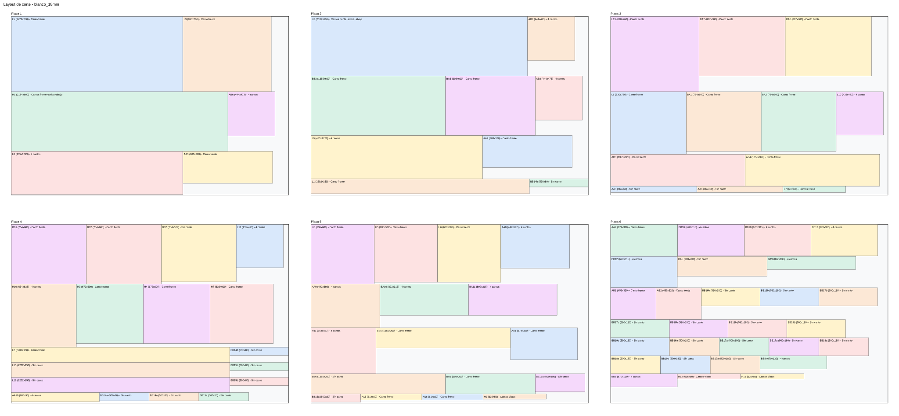
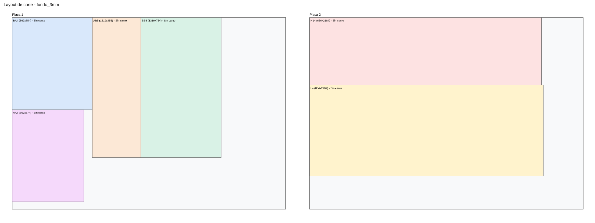
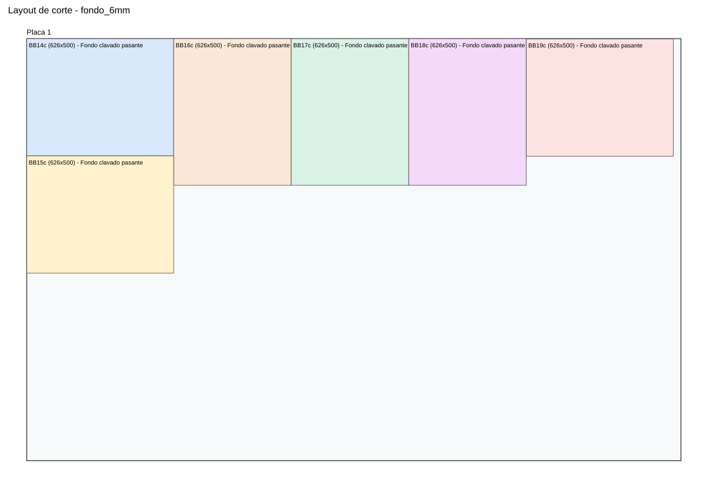
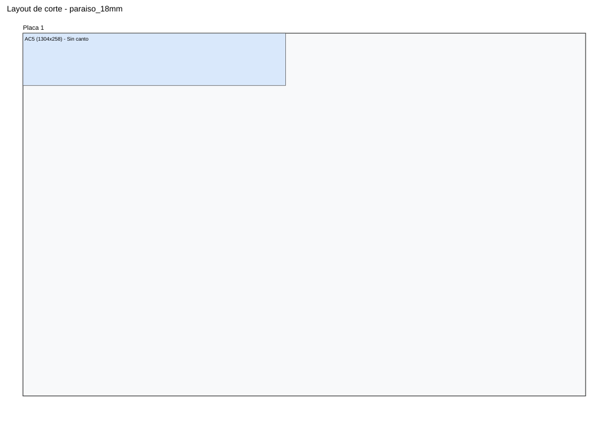

# Manual Constructivo Integral - Cocina

## 1. Ensambles generales

## ENS - Ensamble cocina principal
<figure style="display:inline-block; width:48%; margin:0 1% 10px 0;"><figcaption style="font-size:8.5pt">ENS Iso</figcaption></figure><figure style="display:inline-block; width:48%; margin:0 1% 10px 0;"><figcaption style="font-size:8.5pt">ENS Frente</figcaption></figure><figure style="display:inline-block; width:48%; margin:0 1% 10px 0;"><figcaption style="font-size:8.5pt">ENS Lateral</figcaption></figure><figure style="display:inline-block; width:48%; margin:0 1% 10px 0;"><figcaption style="font-size:8.5pt">ENS Lateral opuesto</figcaption></figure><figure style="display:inline-block; width:48%; margin:0 1% 10px 0;"><figcaption style="font-size:8.5pt">ENS Posterior</figcaption></figure><figure style="display:inline-block; width:48%; margin:0 1% 10px 0;"><figcaption style="font-size:8.5pt">ENS Superior</figcaption></figure>

## ENSI - Ensamble isla
<figure style="display:inline-block; width:48%; margin:0 1% 10px 0;"><figcaption style="font-size:8.5pt">ENSI Iso</figcaption></figure><figure style="display:inline-block; width:48%; margin:0 1% 10px 0;"><figcaption style="font-size:8.5pt">ENSI Frente</figcaption></figure><figure style="display:inline-block; width:48%; margin:0 1% 10px 0;"><figcaption style="font-size:8.5pt">ENSI Lateral</figcaption></figure><figure style="display:inline-block; width:48%; margin:0 1% 10px 0;"><figcaption style="font-size:8.5pt">ENSI Lateral opuesto</figcaption></figure><figure style="display:inline-block; width:48%; margin:0 1% 10px 0;"><figcaption style="font-size:8.5pt">ENSI Posterior</figcaption></figure><figure style="display:inline-block; width:48%; margin:0 1% 10px 0;"><figcaption style="font-size:8.5pt">ENSI Superior</figcaption></figure>

## 2. Lista unica total de partes
| Categoria | Pieza | Cant total | Largo | Ancho | Espesor | Cantos | Modulos | ML gola | Bisagras |
| --- | --- | --- | --- | --- | --- | --- | --- | --- | --- |
| AB_Blanco | AB_Fondo_3mm | 1 | 1319.0 | 455.0 | 3.0 | Sin canto | AB |  |  |
| AB_Blanco | AB_Lateral_Der | 1 | 455.0 | 320.0 | 18.0 | Canto frente | AB |  |  |
| AB_Blanco | AB_Lateral_Izq | 1 | 455.0 | 320.0 | 18.0 | Canto frente | AB |  |  |
| AB_Blanco | AB_Piso | 1 | 1355.0 | 320.0 | 18.0 | Canto frente | AB |  |  |
| AB_Blanco | AB_Tapa | 1 | 1355.0 | 320.0 | 18.0 | Canto frente | AB |  |  |
| AC_Paraiso | AC_Fondo_18mm | 1 | 1283.0 | 273.0 | 18.0 | Crudo (enchapar en obra) | AB |  |  |
| AC_Paraiso | AC_Lateral_Der | 1 | 273.0 | 320.0 | 18.0 | Crudo (enchapar en obra) | AB |  |  |
| AC_Paraiso | AC_Lateral_Der_Interior | 1 | 273.0 | 320.0 | 18.0 | Crudo (enchapar en obra) | AB |  |  |
| AC_Paraiso | AC_Lateral_Izq | 1 | 273.0 | 320.0 | 18.0 | Crudo (enchapar en obra) | AB |  |  |
| AC_Paraiso | AC_Lateral_Izq_Interior | 1 | 273.0 | 320.0 | 18.0 | Crudo (enchapar en obra) | AB |  |  |
| AC_Paraiso | AC_Piso | 1 | 1355.0 | 320.0 | 18.0 | Crudo (enchapar en obra) | AB |  |  |
| AC_Paraiso | AC_Piso_Interior | 1 | 1283.0 | 320.0 | 18.0 | Crudo (enchapar en obra) | AB |  |  |
| AC_Paraiso | AC_Tapa | 1 | 1355.0 | 320.0 | 18.0 | Crudo (enchapar en obra) | AB |  |  |
| AC_Paraiso | AC_Tapa_Interior | 1 | 1283.0 | 320.0 | 18.0 | Crudo (enchapar en obra) | AB |  |  |
| Cajon | BB14_Caja_Top_Izq_Fondo_6mm | 1 | 625.5 | 500.0 | 6.0 | Fondo clavado pasante | BB |  |  |
| Cajon | BB14_Caja_Top_Izq_Frente_Trasera | 2 | 589.5 | 80.0 | 18.0 | Sin canto | BB |  |  |
| Cajon | BB14_Caja_Top_Izq_Lateral | 2 | 500.0 | 80.0 | 18.0 | Sin canto | BB |  |  |
| Cajon | BB15_Caja_Top_Der_Fondo_6mm | 1 | 625.5 | 500.0 | 6.0 | Fondo clavado pasante | BB |  |  |
| Cajon | BB15_Caja_Top_Der_Frente_Trasera | 2 | 589.5 | 80.0 | 18.0 | Sin canto | BB |  |  |
| Cajon | BB15_Caja_Top_Der_Lateral | 2 | 500.0 | 80.0 | 18.0 | Sin canto | BB |  |  |
| Cajon | BB16_Caja_Mid_Izq_Fondo_6mm | 1 | 625.5 | 500.0 | 6.0 | Fondo clavado pasante | BB |  |  |
| Cajon | BB16_Caja_Mid_Izq_Frente_Trasera | 2 | 589.5 | 180.0 | 18.0 | Sin canto | BB |  |  |
| Cajon | BB16_Caja_Mid_Izq_Lateral | 2 | 500.0 | 180.0 | 18.0 | Sin canto | BB |  |  |
| Cajon | BB17_Caja_Mid_Der_Fondo_6mm | 1 | 625.5 | 500.0 | 6.0 | Fondo clavado pasante | BB |  |  |
| Cajon | BB17_Caja_Mid_Der_Frente_Trasera | 2 | 589.5 | 180.0 | 18.0 | Sin canto | BB |  |  |
| Cajon | BB17_Caja_Mid_Der_Lateral | 2 | 500.0 | 180.0 | 18.0 | Sin canto | BB |  |  |
| Cajon | BB18_Caja_Bot_Izq_Fondo_6mm | 1 | 625.5 | 500.0 | 6.0 | Fondo clavado pasante | BB |  |  |
| Cajon | BB18_Caja_Bot_Izq_Frente_Trasera | 2 | 589.5 | 180.0 | 18.0 | Sin canto | BB |  |  |
| Cajon | BB18_Caja_Bot_Izq_Lateral | 2 | 500.0 | 180.0 | 18.0 | Sin canto | BB |  |  |
| Cajon | BB19_Caja_Bot_Der_Fondo_6mm | 1 | 625.5 | 500.0 | 6.0 | Fondo clavado pasante | BB |  |  |
| Cajon | BB19_Caja_Bot_Der_Frente_Trasera | 2 | 589.5 | 180.0 | 18.0 | Sin canto | BB |  |  |
| Cajon | BB19_Caja_Bot_Der_Lateral | 2 | 500.0 | 180.0 | 18.0 | Sin canto | BB |  |  |
| Cajon | I19_Cajon_Sup_Fondo_6mm | 1 | 405.0 | 325.0 | 6.0 | Fondo clavado pasante | I |  |  |
| Cajon | I19_Cajon_Sup_Frente_Trasera | 2 | 369.0 | 170.0 | 18.0 | Sin canto | I |  |  |
| Cajon | I19_Cajon_Sup_Lateral | 2 | 325.0 | 170.0 | 18.0 | Sin canto | I |  |  |
| Cajon | I20_Cajon_Med_Fondo_6mm | 1 | 405.0 | 325.0 | 6.0 | Fondo clavado pasante | I |  |  |
| Cajon | I20_Cajon_Med_Frente_Trasera | 2 | 369.0 | 170.0 | 18.0 | Sin canto | I |  |  |
| Cajon | I20_Cajon_Med_Lateral | 2 | 325.0 | 170.0 | 18.0 | Sin canto | I |  |  |
| Cajon | I21_Cajon_Inf_Fondo_6mm | 1 | 405.0 | 325.0 | 6.0 | Fondo clavado pasante | I |  |  |
| Cajon | I21_Cajon_Inf_Frente_Trasera | 2 | 369.0 | 170.0 | 18.0 | Sin canto | I |  |  |
| Cajon | I21_Cajon_Inf_Lateral | 2 | 325.0 | 170.0 | 18.0 | Sin canto | I |  |  |
| Cajon_Sup | Lateral_Der | 1 | 122.0 | 264.0 | 18.0 | Canto frente | F |  |  |
| Cajon_Sup | Piso_Interior_3xØ60 | 1 | 2284.0 | 264.0 | 18.0 | Sin canto | F |  |  |
| Cajon_Sup | Trasera | 1 | 2284.0 | 82.0 | 18.0 | Sin canto | F |  |  |
| Casco | Fondo_3mm | 1 | 867.0 | 754.0 | 3.0 | Sin canto | BA |  |  |
| Casco | Fondo_3mm | 1 | 1319.0 | 754.0 | 3.0 | Sin canto | BB |  |  |
| Casco | Fondo_Cajonera | 1 | 772.0 | 430.0 | 18.0 | Canto frente | I |  |  |
| Casco | Fondo_Modulo_Izq | 1 | 772.0 | 448.0 | 18.0 | Canto frente | I |  |  |
| Casco | Lateral_Der | 2 | 754.0 | 600.0 | 18.0 | Canto frente | BA,BB |  |  |
| Casco | Lateral_Der | 1 | 2262.0 | 950.0 | 18.0 | Crudo (cinta 36mm en obra) | F |  |  |
| Casco | Lateral_Der | 1 | 772.0 | 650.0 | 18.0 | Canto frente | I |  |  |
| Casco | Lateral_Izq | 2 | 754.0 | 600.0 | 18.0 | Canto frente | BA,BB |  |  |
| Casco | Lateral_Izq | 1 | 2320.0 | 950.0 | 18.0 | Crudo (cinta 36mm en obra) | F |  |  |
| Casco | Lateral_Izq_Frente | 1 | 772.0 | 361.0 | 18.0 | Canto frente | I |  |  |
| Casco | Parante_Front_Der | 1 | 2202.0 | 150.0 | 18.0 | Canto frente | L |  |  |
| Casco | Parante_Front_Izq | 1 | 2202.0 | 150.0 | 18.0 | Canto frente | L |  |  |
| Casco | Parante_Rear_Der | 1 | 2202.0 | 150.0 | 18.0 | Sin canto | L |  |  |
| Casco | Parante_Rear_Izq | 1 | 2202.0 | 150.0 | 18.0 | Sin canto | L |  |  |
| Casco | Piso_Der | 1 | 619.0 | 650.0 | 18.0 | Canto frente | I |  |  |
| Casco | Piso_Izq | 1 | 466.0 | 650.0 | 18.0 | Canto frente | I |  |  |
| Casco | Piso_Modular | 1 | 744.0 | 300.0 | 18.0 | Canto frente | F |  |  |
| Casco | Piso_Pasante | 1 | 903.0 | 600.0 | 18.0 | Canto frente | BA |  |  |
| Casco | Piso_Pasante | 1 | 1355.0 | 600.0 | 18.0 | Canto frente | BB |  |  |
| Casco | Repisa_Separadora | 1 | 867.0 | 600.0 | 18.0 | Canto frente | BA |  |  |
| Casco | Soporte_Sup_Fondo | 1 | 867.0 | 100.0 | 18.0 | Sin canto | BA |  |  |
| Casco | Soporte_Sup_Fondo | 1 | 1319.0 | 100.0 | 18.0 | Sin canto | BB |  |  |
| Casco | Soporte_Sup_Fondo | 1 | 1074.0 | 100.0 | 18.0 | Sin canto | I |  |  |
| Casco | Soporte_Sup_Frente | 1 | 867.0 | 100.0 | 18.0 | Canto frente | BA |  |  |
| Casco | Soporte_Sup_Frente | 1 | 1319.0 | 100.0 | 18.0 | Canto frente | BB |  |  |
| Casco | Soporte_Sup_Frente | 1 | 1504.0 | 100.0 | 18.0 | Canto frente | I |  |  |
| Casco | Tapa_Casco | 1 | 890.0 | 760.0 | 18.0 | Canto frente | L |  |  |
| Division | Divisor_1 | 1 | 754.0 | 650.0 | 18.0 | Canto frente | I |  |  |
| Division | Divisor_2 | 1 | 754.0 | 650.0 | 18.0 | Canto frente | I |  |  |
| Division | Panel_Divisor_Prof | 1 | 744.0 | 2180.0 | 18.0 | Sin canto | F |  |  |
| Division | Parante_Interior | 1 | 1729.0 | 760.0 | 18.0 | Canto frente | L |  |  |
| Division | Parante_Union_CR | 1 | 772.0 | 18.0 | 60.0 | Canto frente | I |  |  |
| Estante_Regulable | Estante_Bajo | 1 | 708.0 | 282.0 | 18.0 | Canto frente | F |  |  |
| Estante_Regulable | Estante_Sup_1 | 1 | 692.0 | 262.0 | 18.0 | Canto frente | F |  |  |
| Estante_Regulable | Estante_Sup_2 | 1 | 692.0 | 262.0 | 18.0 | Canto frente | F |  |  |
| Fondo | Fondo_3mm | 1 | 867.0 | 674.0 | 3.0 | Sin canto | AA |  |  |
| Fondo | Fondo_3mm | 1 | 636.0 | 2184.0 | 3.0 | Sin canto | H |  |  |
| Fondo | Fondo_3mm | 1 | 854.0 | 2202.0 | 3.0 | Sin canto | L |  |  |
| Frente | AB_Puerta_1 | 1 | 444.3333333333333 | 473.0 | 18.0 | 4 cantos | AB |  | 2 |
| Frente | AB_Puerta_2 | 1 | 444.3333333333333 | 473.0 | 18.0 | 4 cantos | AB |  | 2 |
| Frente | AB_Puerta_3 | 1 | 444.3333333333333 | 473.0 | 18.0 | 4 cantos | AB |  | 2 |
| Frente | Faja_Frontal_50 | 1 | 636.0 | 50.0 | 18.0 | Cantos vistos | H |  |  |
| Frente | Faja_Frontal_Inferior_50 | 1 | 636.0 | 50.0 | 18.0 | Cantos vistos | H |  |  |
| Frente | Faja_Frontal_Superior_Micro_50 | 1 | 636.0 | 50.0 | 18.0 | Cantos vistos | H |  |  |
| Frente | Frente_Bot | 2 | 670.0 | 315.0 | 18.0 | 4 cantos | BB |  |  |
| Frente | Frente_Bot_Ancho_Completo | 1 | 892.0 | 315.0 | 18.0 | 4 cantos | BA |  |  |
| Frente | Frente_Cajon_Inf_Izq | 1 | 448.0 | 236.66666666666666 | 18.0 | 4 cantos | I |  |  |
| Frente | Frente_Cajon_Med_Izq | 1 | 448.0 | 236.66666666666666 | 18.0 | 4 cantos | I |  |  |
| Frente | Frente_Cajon_Sup_Izq | 1 | 448.0 | 236.66666666666666 | 18.0 | 4 cantos | I |  |  |
| Frente | Frente_Cajon_Superior | 1 | 2284.0 | 140.0 | 18.0 | 4 cantos | F |  |  |
| Frente | Frente_Derecho | 1 | 441.5 | 692.0 | 18.0 | 4 cantos | AA |  | 2 |
| Frente | Frente_Falso_Sup | 1 | 892.0 | 130.0 | 18.0 | 4 cantos | BA |  |  |
| Frente | Frente_Izquierdo | 1 | 441.5 | 692.0 | 18.0 | 4 cantos | AA |  | 2 |
| Frente | Frente_Lavavajillas | 1 | 537.0 | 738.9999999999999 | 18.0 | 4 cantos | I |  |  |
| Frente | Frente_Mid | 2 | 670.0 | 315.0 | 18.0 | 4 cantos | BB |  |  |
| Frente | Frente_Mid_Ancho_Completo | 1 | 892.0 | 315.0 | 18.0 | 4 cantos | BA |  |  |
| Frente | Frente_Top | 2 | 670.0 | 130.0 | 18.0 | 4 cantos | BB |  |  |
| Frente | Liston_Fijo_90 | 1 | 885.0 | 90.0 | 18.0 | 4 cantos | AA |  |  |
| Frente | Puerta_Der | 1 | 537.0 | 738.9999999999999 | 18.0 | 4 cantos | I |  | 2 |
| Frente | Puerta_Inf_Der | 1 | 435.0 | 1729.0 | 18.0 | 4 cantos | L |  | 3 |
| Frente | Puerta_Inf_Izq | 1 | 435.0 | 1729.0 | 18.0 | 4 cantos | L |  | 3 |
| Frente | Puerta_Inferior | 1 | 654.0 | 638.0 | 18.0 | 4 cantos | H |  | 2 |
| Frente | Puerta_Mod_Der | 1 | 369.0 | 877.0 | 18.0 | 4 cantos | F |  | 2 |
| Frente | Puerta_Mod_Izq | 1 | 369.0 | 877.0 | 18.0 | 4 cantos | F |  | 2 |
| Frente | Puerta_Sup_Der | 1 | 435.0 | 473.0 | 18.0 | 4 cantos | L |  | 2 |
| Frente | Puerta_Sup_Izq | 1 | 435.0 | 473.0 | 18.0 | 4 cantos | L |  | 2 |
| Frente | Puerta_Superior | 1 | 654.0 | 473.0 | 18.0 | 4 cantos | H |  | 2 |
| Herraje | Gola_C_Continuidad | 1 | 672.0 | 25.0 | 20.0 | Aluminio | H | 0.672 |  |
| Herraje | Gola_C_Izq | 1 | 448.0 | 25.0 | 20.0 | Aluminio | I | 0.448 |  |
| Herraje | Gola_C_Media | 1 | 890.0 | 25.0 | 20.0 | Aluminio | L | 0.890 |  |
| Herraje | Gola_C_Superior | 1 | 903.0 | 25.0 | 20.0 | Aluminio | BA | 0.903 |  |
| Herraje | Gola_C_Superior | 1 | 1355.0 | 25.0 | 20.0 | Aluminio | BB | 1.355 |  |
| Herraje | Gola_J_Inferior | 1 | 903.0 | 25.0 | 20.0 | Aluminio | AA | 0.903 |  |
| Herraje | Gola_J_Inferior | 1 | 1355.0 | 25.0 | 20.0 | Aluminio | AB | 1.355 |  |
| Herraje | Gola_J_Media | 1 | 903.0 | 25.0 | 20.0 | Aluminio | BA | 0.903 |  |
| Herraje | Gola_J_Media | 1 | 1355.0 | 25.0 | 20.0 | Aluminio | BB | 1.355 |  |
| Herraje | Gola_J_Sup | 1 | 672.0 | 25.0 | 20.0 | Aluminio | H | 0.672 |  |
| Herraje | Gola_J_Superior | 1 | 1540.0 | 25.0 | 20.0 | Aluminio | I | 1.540 |  |
| Herraje | Pata_80 | 29 | 40.0 | 40.0 | 80.0 | PVC/Aluminio | BA,BB,F,H,I,L |  |  |
| Horizontal | Estante_Fijo_Interior | 1 | 708.0 | 282.0 | 18.0 | Canto frente | F |  |  |
| Horizontal | Estante_Inferior | 1 | 636.0 | 600.0 | 18.0 | Canto frente | H |  |  |
| Horizontal | Piso_Casco | 1 | 672.0 | 600.0 | 18.0 | Canto frente | H |  |  |
| Horizontal | Piso_Casco_Calados | 1 | 903.0 | 320.0 | 18.0 | Canto frente | AA |  |  |
| Horizontal | Piso_Horno | 1 | 636.0 | 582.0 | 18.0 | Canto frente | H |  |  |
| Horizontal | Piso_Micro | 1 | 636.0 | 582.0 | 18.0 | Canto frente | H |  |  |
| Horizontal | Piso_Modulo_Superior | 1 | 890.0 | 760.0 | 18.0 | Canto frente | L |  |  |
| Horizontal | Tapa_Casco | 1 | 672.0 | 600.0 | 18.0 | Canto frente | H |  |  |
| Horizontal | Tapa_Casco_Calados_IzqDer160 | 1 | 903.0 | 320.0 | 18.0 | Canto frente | AA |  |  |
| Horizontal | Tapa_Micro | 1 | 636.0 | 600.0 | 18.0 | Canto frente | H |  |  |
| Horizontal | Techo_Heladera_1800 | 1 | 744.0 | 650.0 | 18.0 | Canto frente | F |  |  |
| Horizontal | Techo_Lavarropas_Der | 1 | 630.0 | 760.0 | 18.0 | Canto frente | L |  |  |
| Interior | Divisor_Central | 1 | 754.0 | 579.0 | 18.0 | Sin canto | BB |  |  |
| Interior | Estante_Inferior | 1 | 867.0 | 600.0 | 18.0 | Canto frente | BA |  |  |
| Interior | Travesano_Inf | 1 | 867.0 | 60.0 | 18.0 | Sin canto | AA |  |  |
| Interior | Travesano_Sup | 1 | 867.0 | 60.0 | 18.0 | Sin canto | AA |  |  |
| Lateral | Lateral_Der | 1 | 674.0 | 320.0 | 18.0 | Canto frente | AA |  |  |
| Lateral | Lateral_Der | 1 | 2184.0 | 600.0 | 18.0 | Cantos frente+arriba+abajo | H |  |  |
| Lateral | Lateral_Izq | 1 | 674.0 | 320.0 | 18.0 | Canto frente | AA |  |  |
| Lateral | Lateral_Izq | 1 | 2184.0 | 600.0 | 18.0 | Cantos frente+arriba+abajo | H |  |  |
| Mesada | Mesada_Calado_Bacha_530x390 | 1 | 1540.0 | 688.0 | 30.0 | Pulido perimetral segun proveedor | I |  |  |
| Mesada | Piedra_Gris_Mara_Calado_600x555 | 1 | 2258.0 | 648.0 | 30.0 | Pulido perimetral segun proveedor | M |  |  |
| Nicho | Estante_Nicho_Regulable | 1 | 288.0 | 287.0 | 18.0 | Canto frente | I |  |  |
| Nicho | Faja_Frontal_Estante_Nicho | 1 | 289.0 | 18.0 | 18.0 | Canto frente | I |  |  |
| Nicho | Faja_Superior_Nicho | 1 | 289.0 | 50.0 | 18.0 | Canto frente | I |  |  |
| Referencia | Extractor_590x470x90 | 1 | 590.0 | 470.0 | 90.0 | No fabricar | AA |  |  |
| Refuerzo | Regrueso_Techo_Lav | 1 | 630.0 | 60.0 | 18.0 | Cantos vistos | L |  |  |
| Regrueso | Liston_Vert_Der | 1 | 599.0 | 60.0 | 18.0 | Canto frente | H |  |  |
| Regrueso | Liston_Vert_Izq | 1 | 599.0 | 60.0 | 18.0 | Canto frente | H |  |  |
| Regrueso | Regrueso_Front_Estante_Sup_1 | 1 | 692.0 | 50.0 | 18.0 | Canto frente | F |  |  |
| Regrueso | Regrueso_Front_Estante_Sup_2 | 1 | 692.0 | 50.0 | 18.0 | Canto frente | F |  |  |
| Regrueso | Regrueso_Sobre_F9 | 1 | 708.0 | 50.0 | 18.0 | Canto frente | F |  |  |
| Regrueso | Regrueso_Vis_Der | 1 | 2162.0 | 282.0 | 18.0 | Crudo (cinta 36mm en obra) | F |  |  |
| Regrueso | Regrueso_Vis_Izq | 1 | 2162.0 | 282.0 | 18.0 | Crudo (cinta 36mm en obra) | F |  |  |

## 3. Modulos

## Modulo H - Columna horno + micro
**Terminacion:** Melamina blanca

<figure style="display:inline-block; width:48%; margin:0 1% 10px 0;"><figcaption style="font-size:8.5pt">H Iso</figcaption></figure><figure style="display:inline-block; width:48%; margin:0 1% 10px 0;"><figcaption style="font-size:8.5pt">H Frente</figcaption></figure><figure style="display:inline-block; width:48%; margin:0 1% 10px 0;"><figcaption style="font-size:8.5pt">H Lateral</figcaption></figure>

### Despiece H
| Codigo | Categoria | Pieza | Cant | Largo | Ancho | Espesor | Cantos | ML gola | Bisagras |
| --- | --- | --- | --- | --- | --- | --- | --- | --- | --- |
| H1 | Lateral | Lateral_Izq | 1 | 2184.0 | 600.0 | 18.0 | Cantos frente+arriba+abajo |  |  |
| H2 | Lateral | Lateral_Der | 1 | 2184.0 | 600.0 | 18.0 | Cantos frente+arriba+abajo |  |  |
| H3 | Horizontal | Piso_Casco | 1 | 672.0 | 600.0 | 18.0 | Canto frente |  |  |
| H3L | Herraje | Pata_80 | 4 | 40.0 | 40.0 | 80.0 | PVC/Aluminio |  |  |
| H4 | Horizontal | Tapa_Casco | 1 | 672.0 | 600.0 | 18.0 | Canto frente |  |  |
| H14 | Fondo | Fondo_3mm | 1 | 636.0 | 2184.0 | 3.0 | Sin canto |  |  |
| H15 | Regrueso | Liston_Vert_Izq | 1 | 599.0 | 60.0 | 18.0 | Canto frente |  |  |
| H16 | Regrueso | Liston_Vert_Der | 1 | 599.0 | 60.0 | 18.0 | Canto frente |  |  |
| H5 | Horizontal | Piso_Horno | 1 | 636.0 | 582.0 | 18.0 | Canto frente |  |  |
| H6 | Horizontal | Piso_Micro | 1 | 636.0 | 582.0 | 18.0 | Canto frente |  |  |
| H7 | Horizontal | Tapa_Micro | 1 | 636.0 | 600.0 | 18.0 | Canto frente |  |  |
| H8 | Horizontal | Estante_Inferior | 1 | 636.0 | 600.0 | 18.0 | Canto frente |  |  |
| H9 | Frente | Faja_Frontal_50 | 1 | 636.0 | 50.0 | 18.0 | Cantos vistos |  |  |
| H12 | Frente | Faja_Frontal_Inferior_50 | 1 | 636.0 | 50.0 | 18.0 | Cantos vistos |  |  |
| H13 | Frente | Faja_Frontal_Superior_Micro_50 | 1 | 636.0 | 50.0 | 18.0 | Cantos vistos |  |  |
| H17 | Herraje | Gola_C_Continuidad | 1 | 672.0 | 25.0 | 20.0 | Aluminio | 0.672 |  |
| H18 | Herraje | Gola_J_Sup | 1 | 672.0 | 25.0 | 20.0 | Aluminio | 0.672 |  |
| H10 | Frente | Puerta_Inferior | 1 | 654.0 | 638.0 | 18.0 | 4 cantos |  | 2 |
| H11 | Frente | Puerta_Superior | 1 | 654.0 | 473.0 | 18.0 | 4 cantos |  | 2 |

### Notas de armado H
# Columna horno + microondas (melamina 18 mm)

## Parametros usados
- Altura total: 2300 mm
- Profundidad total: 600 mm
- Ancho interior util: 636 mm
- Ancho exterior: 672 mm
- Patas: 80 mm (ocultas por zocalo)
- Fondo 3 mm (oculto en vistas de captura)
- Piso y techo del casco pasantes (672 mm), con laterales apoyados
- Laterales entre piso y techo (36 mm menos de altura respecto al casco)
- Piso de horno y piso de micro retranqueados 18 mm (profundidad 582 mm)

## Codigos de piezas (prefijo H)
- H1: Lateral izquierdo
- H2: Lateral derecho
- H3: Piso casco (pasante)
- H4: Tapa casco (pasante)
- H5: Piso horno
- H6: Piso micro
- H7: Tapa micro
- H8: Estante inferior
- H9: Faja frontal central 50 mm (entre horno y micro)
- H10: Puerta inferior
- H11: Puerta superior
- H12: Faja frontal inferior 50 mm (entre puerta inferior y horno)
- H13: Faja frontal superior micro 50 mm (techo del hueco micro)
- H14: Fondo 3 mm
- H15: Liston vertical frontal izq (18 mm frente x 60 mm fondo, solo horno)
- H16: Liston vertical frontal der (18 mm frente x 60 mm fondo, solo horno)
- Hueco horno visible: 600 x 599 mm, arranque a 800 mm desde piso
- Hueco horno interno: 600 x 650 mm
- Hueco microondas: 600 x 436 mm
- Hueco microondas arranca a 1449 mm desde piso (enrasado con faja intermedia)
- Fajas frontales: 3 unidades de 50 mm
- Arriba del micro: puerta
- Abajo del horno: puerta + 1 estante intermedio

## Logica del "regrueso" frontal
Se deja 50 mm extra internos por encima del horno (hueco interno de 650 mm),
y se tapa visualmente con una faja frontal central de 50 mm.
De frente se percibe una separacion marcada entre horno y micro,
pero el horno internamente queda con aire superior extra.

## Herrajes sugeridos
- 4 patas regulables de 80 mm (o 6 si queres mayor rigidez)
- 4 bisagras cazoleta 35 mm para puerta inferior (apertura derecha)
- 3 bisagras cazoleta 35 mm para puerta superior
- 1 juego de soportes para estante interior
- Tornillos confirmat 5x50 o sistema minifix (segun tu preferencia)

## Secuencia de armado (resumen)
1. Cortar y cantear piezas segun BOM.
2. Pre-taladrar laterales para pisos/tapas/estante.
3. Armar casco: laterales + piso inferior + tapa superior.
4. Instalar piso horno, piso micro y tapa micro a cotas definidas.
5. Instalar estante interior inferior a media altura.
6. Colocar las 3 fajas frontales de 50 mm (inferior horno, central y techo micro).
7. Montar patas de 80 mm y nivelar.
8. Colocar puertas, regular bisagras y verificar luces de 2 mm.

## Nota de validacion
Si me pasas el modelo exacto de horno y micro, te ajusto holguras reales de fabricante
(la mayoria pide minimos laterales/superiores especificos).

## Modulo AA - Alacena izquierda
**Terminacion:** Melamina blanca

<figure style="display:inline-block; width:48%; margin:0 1% 10px 0;"><figcaption style="font-size:8.5pt">AA Iso</figcaption></figure><figure style="display:inline-block; width:48%; margin:0 1% 10px 0;"><figcaption style="font-size:8.5pt">AA Frente</figcaption></figure><figure style="display:inline-block; width:48%; margin:0 1% 10px 0;"><figcaption style="font-size:8.5pt">AA Lateral</figcaption></figure>

### Despiece AA
| Codigo | Categoria | Pieza | Cant | Largo | Ancho | Espesor | Cantos | ML gola | Bisagras |
| --- | --- | --- | --- | --- | --- | --- | --- | --- | --- |
| AA1 | Lateral | Lateral_Izq | 1 | 674.0 | 320.0 | 18.0 | Canto frente |  |  |
| AA2 | Lateral | Lateral_Der | 1 | 674.0 | 320.0 | 18.0 | Canto frente |  |  |
| AA3 | Horizontal | Piso_Casco_Calados | 1 | 903.0 | 320.0 | 18.0 | Canto frente |  |  |
| AA4 | Horizontal | Tapa_Casco_Calados_IzqDer160 | 1 | 903.0 | 320.0 | 18.0 | Canto frente |  |  |
| AA5 | Interior | Travesano_Sup | 1 | 867.0 | 60.0 | 18.0 | Sin canto |  |  |
| AA6 | Interior | Travesano_Inf | 1 | 867.0 | 60.0 | 18.0 | Sin canto |  |  |
| AA7 | Fondo | Fondo_3mm | 1 | 867.0 | 674.0 | 3.0 | Sin canto |  |  |
| AA8 | Frente | Frente_Izquierdo | 1 | 441.5 | 692.0 | 18.0 | 4 cantos |  | 2 |
| AA9 | Frente | Frente_Derecho | 1 | 441.5 | 692.0 | 18.0 | 4 cantos |  | 2 |
| AA12 | Herraje | Gola_J_Inferior | 1 | 903.0 | 25.0 | 20.0 | Aluminio | 0.903 |  |
| AA10 | Frente | Liston_Fijo_90 | 1 | 885.0 | 90.0 | 18.0 | 4 cantos |  |  |
| AA11 | Referencia | Extractor_590x470x90 | 1 | 590.0 | 470.0 | 90.0 | No fabricar |  |  |

### Notas de armado AA
# Alacena A (AA) - superior izquierda

## Parametros usados
- Espesor melamina: 18 mm
- Fondo: 3 mm
- Ancho exterior: 1050 mm
- Profundidad exterior: 320 mm
- Alto del mueble: 680 mm
- Piso y tapa pasantes (laterales entre piso y tapa)
- Interior dividido en 2 mitades iguales por divisor vertical central
- Estante solo en lado derecho, a media altura
- 2 puertas iguales (apertura desde centro hacia izquierda y derecha)
- Calado para ducto extractor: diametro 160 mm
- Eje de calado centrado en modulo derecho y a 20 mm del fondo
- El calado atraviesa piso, estante derecho y tapa

## Instalacion recomendada (respecto a cocina)
- Mesada: 900 mm
- Techo: 2300 mm
- Colocacion sugerida: base de alacena a 1620 mm
- Con eso, la alacena llega al techo (1620 + 680 = 2300)

## Codigos de piezas (prefijo AA)
- AA1: lateral izquierdo
- AA2: lateral derecho
- AA3: piso casco (calado 160)
- AA4: tapa casco (calado 160)
- AA5: divisor central
- AA6: estante derecho
- AA7: fondo 3 mm
- AA8: puerta izquierda
- AA9: puerta derecha

## Herrajes sugeridos
- 4 bisagras cazoleta 35 mm (2 por puerta)
- 1 tirador por puerta
- Colgadores de alacena o escuadras segun sistema de fijacion
- Tornillos para melamina (confirmat 5x50 o equivalente)
- Soportes de estante

## Secuencia de armado
1. Cortar y cantear piezas segun BOM.
2. Armar casco: laterales + piso + techo.
3. Colocar divisor central y luego estante derecho a media altura.
4. Fijar fondo de 3 mm escuadrando el mueble.
5. Colocar puertas AA8 y AA9, regular bisagras y dejar luz central de 2 mm.
6. Ejecutar calado de 160 mm en piso/techo antes de montaje final en pared.

## Nota tecnica
- El fondo se deja oculto en las capturas para mantener limpieza visual del modelo.
- Si queres cambiar altura de colgado, modificar la cota de instalacion; el mueble sigue midiendo 680 mm.

## Modulo AB - Alacena derecha + cajon AC
**Terminacion:** AB blanco / AC simil paraiso

<figure style="display:inline-block; width:48%; margin:0 1% 10px 0;"><figcaption style="font-size:8.5pt">AB Iso</figcaption></figure><figure style="display:inline-block; width:48%; margin:0 1% 10px 0;"><figcaption style="font-size:8.5pt">AB Frente</figcaption></figure><figure style="display:inline-block; width:48%; margin:0 1% 10px 0;"><figcaption style="font-size:8.5pt">AB Lateral</figcaption></figure>

### Despiece AB
| Codigo | Categoria | Pieza | Cant | Largo | Ancho | Espesor | Cantos | ML gola | Bisagras |
| --- | --- | --- | --- | --- | --- | --- | --- | --- | --- |
| AC1 | AC_Paraiso | AC_Lateral_Izq | 1 | 273.0 | 320.0 | 18.0 | Crudo (enchapar en obra) |  |  |
| AC2 | AC_Paraiso | AC_Lateral_Der | 1 | 273.0 | 320.0 | 18.0 | Crudo (enchapar en obra) |  |  |
| AC3 | AC_Paraiso | AC_Piso | 1 | 1355.0 | 320.0 | 18.0 | Crudo (enchapar en obra) |  |  |
| AC4 | AC_Paraiso | AC_Tapa | 1 | 1355.0 | 320.0 | 18.0 | Crudo (enchapar en obra) |  |  |
| AC6 | AC_Paraiso | AC_Lateral_Izq_Interior | 1 | 273.0 | 320.0 | 18.0 | Crudo (enchapar en obra) |  |  |
| AC7 | AC_Paraiso | AC_Lateral_Der_Interior | 1 | 273.0 | 320.0 | 18.0 | Crudo (enchapar en obra) |  |  |
| AC8 | AC_Paraiso | AC_Piso_Interior | 1 | 1283.0 | 320.0 | 18.0 | Crudo (enchapar en obra) |  |  |
| AC9 | AC_Paraiso | AC_Tapa_Interior | 1 | 1283.0 | 320.0 | 18.0 | Crudo (enchapar en obra) |  |  |
| AC5 | AC_Paraiso | AC_Fondo_18mm | 1 | 1283.0 | 273.0 | 18.0 | Crudo (enchapar en obra) |  |  |
| AB1 | AB_Blanco | AB_Lateral_Izq | 1 | 455.0 | 320.0 | 18.0 | Canto frente |  |  |
| AB2 | AB_Blanco | AB_Lateral_Der | 1 | 455.0 | 320.0 | 18.0 | Canto frente |  |  |
| AB3 | AB_Blanco | AB_Piso | 1 | 1355.0 | 320.0 | 18.0 | Canto frente |  |  |
| AB4 | AB_Blanco | AB_Tapa | 1 | 1355.0 | 320.0 | 18.0 | Canto frente |  |  |
| AB5 | AB_Blanco | AB_Fondo_3mm | 1 | 1319.0 | 455.0 | 3.0 | Sin canto |  |  |
| AB6 | Frente | AB_Puerta_1 | 1 | 444.3333333333333 | 473.0 | 18.0 | 4 cantos |  | 2 |
| AB7 | Frente | AB_Puerta_2 | 1 | 444.3333333333333 | 473.0 | 18.0 | 4 cantos |  | 2 |
| AB8 | Frente | AB_Puerta_3 | 1 | 444.3333333333333 | 473.0 | 18.0 | 4 cantos |  | 2 |
| AB9 | Herraje | Gola_J_Inferior | 1 | 1355.0 | 25.0 | 20.0 | Aluminio | 1.355 |  |

### Notas de armado AB
# Conjunto derecho AB + AC

## Parametros
- Ancho exterior total: 1355 mm
- Profundidad: 320 mm
- AC inferior en simil paraiso
- AB superior en melamina blanca

## Configuracion AC
- Doble bastidor en 18 mm: uno exterior y otro interior
- Fondo en 18 mm por dentro del bastidor interior
- Cantos crudos en todas las piezas de AC para enchapar en obra

## Configuracion AB
- 3 puertas iguales
- Gola J inferior continua
- Fondo 3 mm

## Nota
- AC reemplaza la solucion anterior en 25.4 mm: ahora es doble 18 mm (36 mm visuales) + fondo de 18 mm.

## Modulo L - Frente armario lavarropas
**Terminacion:** Melamina blanca

<figure style="display:inline-block; width:48%; margin:0 1% 10px 0;"><figcaption style="font-size:8.5pt">L Iso</figcaption></figure><figure style="display:inline-block; width:48%; margin:0 1% 10px 0;"><figcaption style="font-size:8.5pt">L Frente</figcaption></figure><figure style="display:inline-block; width:48%; margin:0 1% 10px 0;"><figcaption style="font-size:8.5pt">L Lateral</figcaption></figure>

### Despiece L
| Codigo | Categoria | Pieza | Cant | Largo | Ancho | Espesor | Cantos | ML gola | Bisagras |
| --- | --- | --- | --- | --- | --- | --- | --- | --- | --- |
| L1 | Casco | Parante_Front_Izq | 1 | 2202.0 | 150.0 | 18.0 | Canto frente |  |  |
| L2 | Casco | Parante_Front_Der | 1 | 2202.0 | 150.0 | 18.0 | Canto frente |  |  |
| L15 | Casco | Parante_Rear_Izq | 1 | 2202.0 | 150.0 | 18.0 | Sin canto |  |  |
| L16 | Casco | Parante_Rear_Der | 1 | 2202.0 | 150.0 | 18.0 | Sin canto |  |  |
| L17 | Herraje | Pata_80 | 4 | 40.0 | 40.0 | 80.0 | PVC/Aluminio |  |  |
| L3 | Casco | Tapa_Casco | 1 | 890.0 | 760.0 | 18.0 | Canto frente |  |  |
| L4 | Fondo | Fondo_3mm | 1 | 854.0 | 2202.0 | 3.0 | Sin canto |  |  |
| L5 | Division | Parante_Interior | 1 | 1729.0 | 760.0 | 18.0 | Canto frente |  |  |
| L6 | Horizontal | Techo_Lavarropas_Der | 1 | 630.0 | 760.0 | 18.0 | Canto frente |  |  |
| L7 | Refuerzo | Regrueso_Techo_Lav | 1 | 630.0 | 60.0 | 18.0 | Cantos vistos |  |  |
| L13 | Horizontal | Piso_Modulo_Superior | 1 | 890.0 | 760.0 | 18.0 | Canto frente |  |  |
| L8 | Frente | Puerta_Inf_Izq | 1 | 435.0 | 1729.0 | 18.0 | 4 cantos |  | 3 |
| L9 | Frente | Puerta_Inf_Der | 1 | 435.0 | 1729.0 | 18.0 | 4 cantos |  | 3 |
| L10 | Frente | Puerta_Sup_Izq | 1 | 435.0 | 473.0 | 18.0 | 4 cantos |  | 2 |
| L11 | Frente | Puerta_Sup_Der | 1 | 435.0 | 473.0 | 18.0 | 4 cantos |  | 2 |
| L12 | Herraje | Gola_C_Media | 1 | 890.0 | 25.0 | 20.0 | Aluminio | 0.890 |  |

### Notas de armado L
1. Armar casco `L1-L4` sobre patas/zócalo de `80 mm`, verificando escuadra y plomo.
2. Colocar fondo `L5` (3 mm) clavado/atornillado para rigidizar el frente completo.
3. Instalar divisor `L6` a `260 mm` desde el lateral derecho (medida exterior), dejando nicho derecho para escobas.
4. Montar `L7` (techo lavarropas) con cara superior a `900 mm` y reforzar con `L8` por debajo.
5. Montar faja frontal `L9` de `50 mm` en la cota alineada con puerta superior de `H`.
6. Verificar calados en piso/tapa:
   - piso `L3`: 3 perforaciones de `35 mm` para conexiones;
   - tapa `L4`: perforación `160 mm` para ducto.
7. Instalar golas:
   - `L12` (J inferior) alineada con nivel de puerta inferior de `H`;
   - `L15` (J superior) bajo puertas superiores.
8. Colgar frentes:
   - inferiores `L10-L11` (2 hojas iguales);
   - superiores `L13-L14` (2 hojas iguales).
9. Ajustar luces finales (2 mm central) y solape lateral (9 mm) en todas las hojas.

## Modulo BA - Bajo mesada izquierdo
**Terminacion:** Melamina blanca

<figure style="display:inline-block; width:48%; margin:0 1% 10px 0;"><figcaption style="font-size:8.5pt">BA Iso</figcaption></figure><figure style="display:inline-block; width:48%; margin:0 1% 10px 0;"><figcaption style="font-size:8.5pt">BA Frente</figcaption></figure><figure style="display:inline-block; width:48%; margin:0 1% 10px 0;"><figcaption style="font-size:8.5pt">BA Lateral</figcaption></figure>

### Despiece BA
| Codigo | Categoria | Pieza | Cant | Largo | Ancho | Espesor | Cantos | ML gola | Bisagras |
| --- | --- | --- | --- | --- | --- | --- | --- | --- | --- |
| BA1 | Casco | Lateral_Izq | 1 | 754.0 | 600.0 | 18.0 | Canto frente |  |  |
| BA2 | Casco | Lateral_Der | 1 | 754.0 | 600.0 | 18.0 | Canto frente |  |  |
| BA3 | Casco | Piso_Pasante | 1 | 903.0 | 600.0 | 18.0 | Canto frente |  |  |
| BA3L | Herraje | Pata_80 | 4 | 40.0 | 40.0 | 80.0 | PVC/Aluminio |  |  |
| BA4 | Casco | Fondo_3mm | 1 | 867.0 | 754.0 | 3.0 | Sin canto |  |  |
| BA5 | Casco | Soporte_Sup_Frente | 1 | 867.0 | 100.0 | 18.0 | Canto frente |  |  |
| BA6 | Casco | Soporte_Sup_Fondo | 1 | 867.0 | 100.0 | 18.0 | Sin canto |  |  |
| BA7 | Casco | Repisa_Separadora | 1 | 867.0 | 600.0 | 18.0 | Canto frente |  |  |
| BA8 | Interior | Estante_Inferior | 1 | 867.0 | 600.0 | 18.0 | Canto frente |  |  |
| BA9 | Frente | Frente_Falso_Sup | 1 | 892.0 | 130.0 | 18.0 | 4 cantos |  |  |
| BA10 | Frente | Frente_Mid_Ancho_Completo | 1 | 892.0 | 315.0 | 18.0 | 4 cantos |  |  |
| BA11 | Frente | Frente_Bot_Ancho_Completo | 1 | 892.0 | 315.0 | 18.0 | 4 cantos |  |  |
| BA12 | Herraje | Gola_C_Superior | 1 | 903.0 | 25.0 | 20.0 | Aluminio | 0.903 |  |
| BA13 | Herraje | Gola_J_Media | 1 | 903.0 | 25.0 | 20.0 | Aluminio | 0.903 |  |

### Notas de armado BA
# Bajo mesada BA

- Ancho: 903 mm
- Profundidad: 600 mm
- Alto casco: 870 mm
- Zocalo: 80 mm
- Fila superior: 130 mm
- Soportes superiores de mesada: 100 mm de profundidad, por dentro del casco
- Configuracion: frente falso superior bajo anafe + 2 puertas inferiores + estante interior

## Modulo BB - Bajo mesada derecho
**Terminacion:** Melamina blanca

<figure style="display:inline-block; width:48%; margin:0 1% 10px 0;"><figcaption style="font-size:8.5pt">BB Iso</figcaption></figure><figure style="display:inline-block; width:48%; margin:0 1% 10px 0;"><figcaption style="font-size:8.5pt">BB Frente</figcaption></figure><figure style="display:inline-block; width:48%; margin:0 1% 10px 0;"><figcaption style="font-size:8.5pt">BB Lateral</figcaption></figure>

### Despiece BB
| Codigo | Categoria | Pieza | Cant | Largo | Ancho | Espesor | Cantos | ML gola | Bisagras |
| --- | --- | --- | --- | --- | --- | --- | --- | --- | --- |
| BB1 | Casco | Lateral_Izq | 1 | 754.0 | 600.0 | 18.0 | Canto frente |  |  |
| BB2 | Casco | Lateral_Der | 1 | 754.0 | 600.0 | 18.0 | Canto frente |  |  |
| BB3 | Casco | Piso_Pasante | 1 | 1355.0 | 600.0 | 18.0 | Canto frente |  |  |
| BB3L | Herraje | Pata_80 | 4 | 40.0 | 40.0 | 80.0 | PVC/Aluminio |  |  |
| BB4 | Casco | Fondo_3mm | 1 | 1319.0 | 754.0 | 3.0 | Sin canto |  |  |
| BB5 | Casco | Soporte_Sup_Frente | 1 | 1319.0 | 100.0 | 18.0 | Canto frente |  |  |
| BB6 | Casco | Soporte_Sup_Fondo | 1 | 1319.0 | 100.0 | 18.0 | Sin canto |  |  |
| BB7 | Interior | Divisor_Central | 1 | 754.0 | 579.0 | 18.0 | Sin canto |  |  |
| BB8 | Frente | Frente_Top | 2 | 670.0 | 130.0 | 18.0 | 4 cantos |  |  |
| BB10 | Frente | Frente_Mid | 2 | 670.0 | 315.0 | 18.0 | 4 cantos |  |  |
| BB12 | Frente | Frente_Bot | 2 | 670.0 | 315.0 | 18.0 | 4 cantos |  |  |
| BB14a | Cajon | BB14_Caja_Top_Izq_Lateral | 2 | 500.0 | 80.0 | 18.0 | Sin canto |  |  |
| BB14b | Cajon | BB14_Caja_Top_Izq_Frente_Trasera | 2 | 589.5 | 80.0 | 18.0 | Sin canto |  |  |
| BB14c | Cajon | BB14_Caja_Top_Izq_Fondo_6mm | 1 | 625.5 | 500.0 | 6.0 | Fondo clavado pasante |  |  |
| BB15a | Cajon | BB15_Caja_Top_Der_Lateral | 2 | 500.0 | 80.0 | 18.0 | Sin canto |  |  |
| BB15b | Cajon | BB15_Caja_Top_Der_Frente_Trasera | 2 | 589.5 | 80.0 | 18.0 | Sin canto |  |  |
| BB15c | Cajon | BB15_Caja_Top_Der_Fondo_6mm | 1 | 625.5 | 500.0 | 6.0 | Fondo clavado pasante |  |  |
| BB16a | Cajon | BB16_Caja_Mid_Izq_Lateral | 2 | 500.0 | 180.0 | 18.0 | Sin canto |  |  |
| BB16b | Cajon | BB16_Caja_Mid_Izq_Frente_Trasera | 2 | 589.5 | 180.0 | 18.0 | Sin canto |  |  |
| BB16c | Cajon | BB16_Caja_Mid_Izq_Fondo_6mm | 1 | 625.5 | 500.0 | 6.0 | Fondo clavado pasante |  |  |
| BB17a | Cajon | BB17_Caja_Mid_Der_Lateral | 2 | 500.0 | 180.0 | 18.0 | Sin canto |  |  |
| BB17b | Cajon | BB17_Caja_Mid_Der_Frente_Trasera | 2 | 589.5 | 180.0 | 18.0 | Sin canto |  |  |
| BB17c | Cajon | BB17_Caja_Mid_Der_Fondo_6mm | 1 | 625.5 | 500.0 | 6.0 | Fondo clavado pasante |  |  |
| BB18a | Cajon | BB18_Caja_Bot_Izq_Lateral | 2 | 500.0 | 180.0 | 18.0 | Sin canto |  |  |
| BB18b | Cajon | BB18_Caja_Bot_Izq_Frente_Trasera | 2 | 589.5 | 180.0 | 18.0 | Sin canto |  |  |
| BB18c | Cajon | BB18_Caja_Bot_Izq_Fondo_6mm | 1 | 625.5 | 500.0 | 6.0 | Fondo clavado pasante |  |  |
| BB19a | Cajon | BB19_Caja_Bot_Der_Lateral | 2 | 500.0 | 180.0 | 18.0 | Sin canto |  |  |
| BB19b | Cajon | BB19_Caja_Bot_Der_Frente_Trasera | 2 | 589.5 | 180.0 | 18.0 | Sin canto |  |  |
| BB19c | Cajon | BB19_Caja_Bot_Der_Fondo_6mm | 1 | 625.5 | 500.0 | 6.0 | Fondo clavado pasante |  |  |
| BB20 | Herraje | Gola_C_Superior | 1 | 1355.0 | 25.0 | 20.0 | Aluminio | 1.355 |  |
| BB21 | Herraje | Gola_J_Media | 1 | 1355.0 | 25.0 | 20.0 | Aluminio | 1.355 |  |

### Notas de armado BB
# Bajo mesada BB

- Ancho: 1355 mm
- Profundidad: 600 mm
- Alto casco: 870 mm
- Zocalo: 80 mm
- Fila superior: 130 mm
- Soportes superiores de mesada: 100 mm de profundidad, por dentro del casco
- Configuracion: 6 cajones (2 columnas x 3 filas)

## Modulo F - Mueble heladera + modular
**Terminacion:** Paraiso + blanco

<figure style="display:inline-block; width:48%; margin:0 1% 10px 0;"><figcaption style="font-size:8.5pt">F Iso</figcaption></figure><figure style="display:inline-block; width:48%; margin:0 1% 10px 0;"><figcaption style="font-size:8.5pt">F Frente</figcaption></figure><figure style="display:inline-block; width:48%; margin:0 1% 10px 0;"><figcaption style="font-size:8.5pt">F Lateral</figcaption></figure>

### Despiece F
| Codigo | Categoria | Pieza | Cant | Largo | Ancho | Espesor | Cantos | ML gola | Bisagras |
| --- | --- | --- | --- | --- | --- | --- | --- | --- | --- |
| F1 | Casco | Lateral_Izq | 1 | 2320.0 | 950.0 | 18.0 | Crudo (cinta 36mm en obra) |  |  |
| F2 | Casco | Lateral_Der | 1 | 2262.0 | 950.0 | 18.0 | Crudo (cinta 36mm en obra) |  |  |
| F3 | Casco | Piso_Modular | 1 | 744.0 | 300.0 | 18.0 | Canto frente |  |  |
| F3L | Herraje | Pata_80 | 5 | 40.0 | 40.0 | 80.0 | PVC/Aluminio |  |  |
| F5 | Division | Panel_Divisor_Prof | 1 | 744.0 | 2180.0 | 18.0 | Sin canto |  |  |
| F14 | Regrueso | Regrueso_Vis_Izq | 1 | 2162.0 | 282.0 | 18.0 | Crudo (cinta 36mm en obra) |  |  |
| F15 | Regrueso | Regrueso_Vis_Der | 1 | 2162.0 | 282.0 | 18.0 | Crudo (cinta 36mm en obra) |  |  |
| F6 | Horizontal | Techo_Heladera_1800 | 1 | 744.0 | 650.0 | 18.0 | Canto frente |  |  |
| F7 | Estante_Regulable | Estante_Bajo | 1 | 708.0 | 282.0 | 18.0 | Canto frente |  |  |
| F9 | Horizontal | Estante_Fijo_Interior | 1 | 708.0 | 282.0 | 18.0 | Canto frente |  |  |
| F20 | Regrueso | Regrueso_Sobre_F9 | 1 | 708.0 | 50.0 | 18.0 | Canto frente |  |  |
| F10 | Estante_Regulable | Estante_Sup_1 | 1 | 692.0 | 262.0 | 18.0 | Canto frente |  |  |
| F16 | Regrueso | Regrueso_Front_Estante_Sup_1 | 1 | 692.0 | 50.0 | 18.0 | Canto frente |  |  |
| F11 | Estante_Regulable | Estante_Sup_2 | 1 | 692.0 | 262.0 | 18.0 | Canto frente |  |  |
| F17 | Regrueso | Regrueso_Front_Estante_Sup_2 | 1 | 692.0 | 50.0 | 18.0 | Canto frente |  |  |
| F12 | Frente | Puerta_Mod_Izq | 1 | 369.0 | 877.0 | 18.0 | 4 cantos |  | 2 |
| F13 | Frente | Puerta_Mod_Der | 1 | 369.0 | 877.0 | 18.0 | 4 cantos |  | 2 |
| F23 | Cajon_Sup | Lateral_Der | 1 | 122.0 | 264.0 | 18.0 | Canto frente |  |  |
| F24 | Cajon_Sup | Trasera | 1 | 2284.0 | 82.0 | 18.0 | Sin canto |  |  |
| F25 | Cajon_Sup | Piso_Interior_3xØ60 | 1 | 2284.0 | 264.0 | 18.0 | Sin canto |  |  |
| F26 | Frente | Frente_Cajon_Superior | 1 | 2284.0 | 140.0 | 18.0 | 4 cantos |  |  |

### Notas de armado F
# Mueble F (heladera + modular)

- Alto total: 2400 mm
- Ancho cuerpo: 780 mm
- Profundidad total: 950 mm
- Modular posterior: 300 mm de profundidad
- Cajon superior corrido integrado, volado hacia la derecha

## Nota constructiva
- Los pares de cantos dobles visibles (`F1/F14` y `F2/F15`) se dejan crudos en taller.
- Enchapar en obra con cinta continua de 36 mm para evitar lectura de junta entre placas.

## Modulo I - Bajo mesada isla
**Terminacion:** Melamina blanca

<figure style="display:inline-block; width:48%; margin:0 1% 10px 0;"><figcaption style="font-size:8.5pt">I Iso</figcaption></figure><figure style="display:inline-block; width:48%; margin:0 1% 10px 0;"><figcaption style="font-size:8.5pt">I Frente</figcaption></figure><figure style="display:inline-block; width:48%; margin:0 1% 10px 0;"><figcaption style="font-size:8.5pt">I Lateral</figcaption></figure>

### Despiece I
| Codigo | Categoria | Pieza | Cant | Largo | Ancho | Espesor | Cantos | ML gola | Bisagras |
| --- | --- | --- | --- | --- | --- | --- | --- | --- | --- |
| I1 | Casco | Lateral_Izq_Frente | 1 | 772.0 | 361.0 | 18.0 | Canto frente |  |  |
| I1B | Casco | Fondo_Modulo_Izq | 1 | 772.0 | 448.0 | 18.0 | Canto frente |  |  |
| I1C | Casco | Fondo_Cajonera | 1 | 772.0 | 430.0 | 18.0 | Canto frente |  |  |
| I2 | Casco | Lateral_Der | 1 | 772.0 | 650.0 | 18.0 | Canto frente |  |  |
| I3 | Division | Divisor_1 | 1 | 754.0 | 650.0 | 18.0 | Canto frente |  |  |
| I4 | Division | Divisor_2 | 1 | 754.0 | 650.0 | 18.0 | Canto frente |  |  |
| I4B | Division | Parante_Union_CR | 1 | 772.0 | 18.0 | 60.0 | Canto frente |  |  |
| I5 | Casco | Piso_Izq | 1 | 466.0 | 650.0 | 18.0 | Canto frente |  |  |
| I6 | Casco | Piso_Der | 1 | 619.0 | 650.0 | 18.0 | Canto frente |  |  |
| I8 | Nicho | Estante_Nicho_Regulable | 1 | 288.0 | 287.0 | 18.0 | Canto frente |  |  |
| I8C | Nicho | Faja_Frontal_Estante_Nicho | 1 | 289.0 | 18.0 | 18.0 | Canto frente |  |  |
| I8B | Nicho | Faja_Superior_Nicho | 1 | 289.0 | 50.0 | 18.0 | Canto frente |  |  |
| I9 | Casco | Soporte_Sup_Frente | 1 | 1504.0 | 100.0 | 18.0 | Canto frente |  |  |
| I10 | Casco | Soporte_Sup_Fondo | 1 | 1074.0 | 100.0 | 18.0 | Sin canto |  |  |
| I11 | Herraje | Pata_80 | 8 | 40.0 | 40.0 | 80.0 | PVC/Aluminio |  |  |
| I12 | Herraje | Gola_J_Superior | 1 | 1540.0 | 25.0 | 20.0 | Aluminio | 1.540 |  |
| I13 | Herraje | Gola_C_Izq | 1 | 448.0 | 25.0 | 20.0 | Aluminio | 0.448 |  |
| I14 | Frente | Frente_Cajon_Sup_Izq | 1 | 448.0 | 236.66666666666666 | 18.0 | 4 cantos |  |  |
| I15 | Frente | Frente_Cajon_Med_Izq | 1 | 448.0 | 236.66666666666666 | 18.0 | 4 cantos |  |  |
| I16 | Frente | Frente_Cajon_Inf_Izq | 1 | 448.0 | 236.66666666666666 | 18.0 | 4 cantos |  |  |
| I17 | Frente | Frente_Lavavajillas | 1 | 537.0 | 738.9999999999999 | 18.0 | 4 cantos |  |  |
| I18 | Frente | Puerta_Der | 1 | 537.0 | 738.9999999999999 | 18.0 | 4 cantos |  | 2 |
| I19a | Cajon | I19_Cajon_Sup_Lateral | 2 | 325.0 | 170.0 | 18.0 | Sin canto |  |  |
| I19b | Cajon | I19_Cajon_Sup_Frente_Trasera | 2 | 369.0 | 170.0 | 18.0 | Sin canto |  |  |
| I19c | Cajon | I19_Cajon_Sup_Fondo_6mm | 1 | 405.0 | 325.0 | 6.0 | Fondo clavado pasante |  |  |
| I20a | Cajon | I20_Cajon_Med_Lateral | 2 | 325.0 | 170.0 | 18.0 | Sin canto |  |  |
| I20b | Cajon | I20_Cajon_Med_Frente_Trasera | 2 | 369.0 | 170.0 | 18.0 | Sin canto |  |  |
| I20c | Cajon | I20_Cajon_Med_Fondo_6mm | 1 | 405.0 | 325.0 | 6.0 | Fondo clavado pasante |  |  |
| I21a | Cajon | I21_Cajon_Inf_Lateral | 2 | 325.0 | 170.0 | 18.0 | Sin canto |  |  |
| I21b | Cajon | I21_Cajon_Inf_Frente_Trasera | 2 | 369.0 | 170.0 | 18.0 | Sin canto |  |  |
| I21c | Cajon | I21_Cajon_Inf_Fondo_6mm | 1 | 405.0 | 325.0 | 6.0 | Fondo clavado pasante |  |  |
| I22 | Mesada | Mesada_Calado_Bacha_530x390 | 1 | 1540.0 | 688.0 | 30.0 | Pulido perimetral segun proveedor |  |  |

### Notas de armado I
# Bajo mesada isla I

## Parametros
- Ancho: 1540 mm
- Profundidad casco/frentes: 650 mm
- Mesada: 688 mm de profundidad total
- Alto casco: 870 mm
- Zocalo/patas: 80 mm
- Nicho lavavajillas libre: 455 mm
- Nicho izquierdo: 290 mm de ancho x 289 mm de profundidad

## Configuracion
- Columna izquierda: 3 cajones iguales
- Centro: frente lavavajillas
- Derecha: puerta
- Nicho izquierdo posterior abierto con un estante regulable
- Faja superior de nicho en el eje Y y otra faja frontal bajo estante para engrosar visualmente

## Herrajes
- Gola J superior continua
- Gola C en columna izquierda para cajones medio e inferior
- Correderas telescopicas para 3 cajones
- Patas 80 mm

## Nota
- El nicho izquierdo ya no lleva cava integrada.
- La piedra sobresale respecto del frente y la profundidad total terminada es 688 mm.

## Modulo M - Mesada principal
**Terminacion:** Piedra gris mara

<figure style="display:inline-block; width:48%; margin:0 1% 10px 0;"><figcaption style="font-size:8.5pt">M Iso</figcaption></figure><figure style="display:inline-block; width:48%; margin:0 1% 10px 0;"><figcaption style="font-size:8.5pt">M Frente</figcaption></figure><figure style="display:inline-block; width:48%; margin:0 1% 10px 0;"><figcaption style="font-size:8.5pt">M Lateral</figcaption></figure>

### Despiece M
| Codigo | Categoria | Pieza | Cant | Largo | Ancho | Espesor | Cantos | ML gola | Bisagras |
| --- | --- | --- | --- | --- | --- | --- | --- | --- | --- |
| M1 | Mesada | Piedra_Gris_Mara_Calado_600x555 | 1 | 2258.0 | 648.0 | 30.0 | Pulido perimetral segun proveedor |  |  |

### Notas de armado M
# Mesada piedra gris mara

## Parametros
- Largo total: 2258 mm
- Profundidad: 600 mm
- Espesor: 30 mm
- Cota inferior: 870 mm (cota superior final 900 mm)

## Calado anafe
- Calado: 600 x 555 mm
- Centro del calado en X=783 mm (alineado con eje de ducto)
- Centro del calado en Y=300 mm (centrado en profundidad)

## Nota
- Verificar plantilla final in situ antes de corte definitivo de piedra.

## 4. Plan de corte
| Grupo | Piezas | Placas | Placa util (mm) | Kerf | Margen | Aprovechamiento | Descarte |
| --- | --- | --- | --- | --- | --- | --- | --- |
| blanco_18mm | 140 | 10 | 2800 x 1810 | 3 | 10 | 80.70% | 19.30% |
| fondo_3mm | 6 | 2 | 2800 x 1810 | 3 | 10 | 60.59% | 39.41% |
| fondo_6mm | 9 | 1 | 2800 x 1810 | 3 | 10 | 45.38% | 54.62% |
| paraiso_18mm | 9 | 1 | 2800 x 1810 | 3 | 10 | 47.74% | 52.26% |

### Layouts por grupo
<figure style="display:inline-block; width:96%; margin:0 1% 10px 0;"><figcaption style="font-size:8.5pt">Layout blanco_18mm</figcaption></figure>

<figure style="display:inline-block; width:96%; margin:0 1% 10px 0;"><figcaption style="font-size:8.5pt">Layout fondo_3mm</figcaption></figure>

<figure style="display:inline-block; width:96%; margin:0 1% 10px 0;"><figcaption style="font-size:8.5pt">Layout fondo_6mm</figcaption></figure>

<figure style="display:inline-block; width:96%; margin:0 1% 10px 0;"><figcaption style="font-size:8.5pt">Layout paraiso_18mm</figcaption></figure>

