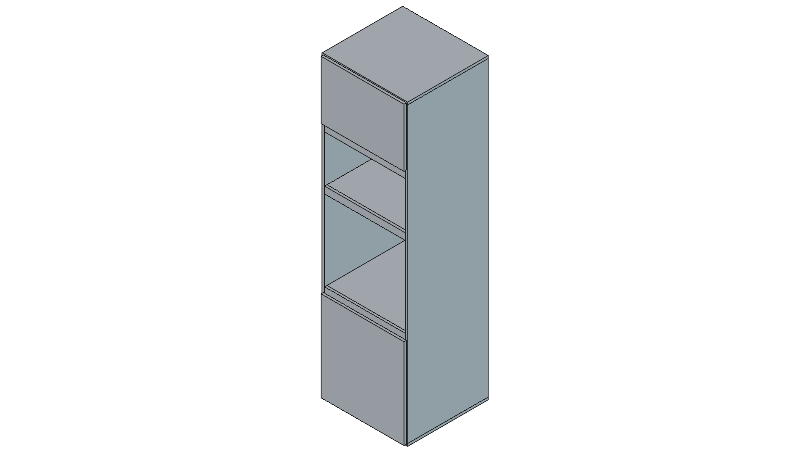
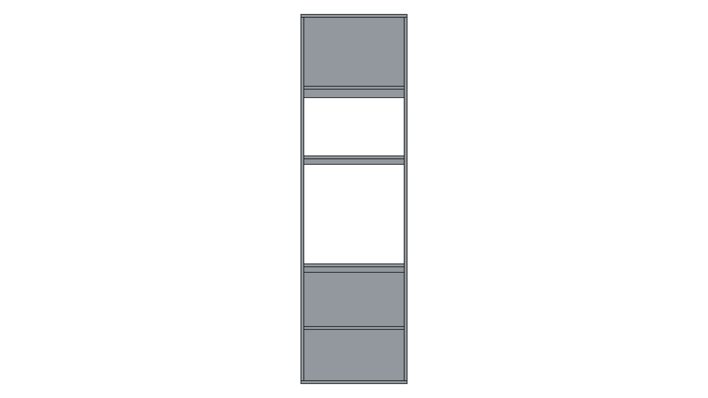

# Manual Constructivo - Mueble H

**Módulo:** Columna Horno + Microondas
**Código:** H
**Terminación:** Melamina blanca
**Espesor estándar:** 18 mm

## Vistas del Mueble
<figure style="display:inline-block; width:48%; margin:0 1% 12px 0;"><figcaption style="font-size:11px">Isométrica</figcaption></figure>
<figure style="display:inline-block; width:48%; margin:0 1% 12px 0;"><figcaption style="font-size:11px">Frente</figcaption></figure>
<figure style="display:inline-block; width:48%; margin:0 1% 12px 0;"><figcaption style="font-size:11px">Posterior</figcaption></figure>
<figure style="display:inline-block; width:48%; margin:0 1% 12px 0;"><figcaption style="font-size:11px">Lateral Izquierdo</figcaption></figure>
<figure style="display:inline-block; width:48%; margin:0 1% 12px 0;"><figcaption style="font-size:11px">Lateral Derecho</figcaption></figure>
<figure style="display:inline-block; width:48%; margin:0 1% 12px 0;"><figcaption style="font-size:11px">Superior</figcaption></figure>
<figure style="display:inline-block; width:48%; margin:0 1% 12px 0;"><figcaption style="font-size:11px">Inferior</figcaption></figure>

## Detalle de Cortes
| Código | Categoría | Pieza | Cant. | Largo (mm) | Ancho (mm) | Espesor (mm) | Cantos |
|---|---|---:|---:|---:|---:|---:|---|
| H1 | Lateral | Lateral_Izq | 1 | 2184.0 | 600.0 | 18.0 | Cantos frente+arriba+abajo |
| H2 | Lateral | Lateral_Der | 1 | 2184.0 | 600.0 | 18.0 | Cantos frente+arriba+abajo |
| H3 | Horizontal | Piso_Casco | 1 | 636.0 | 600.0 | 18.0 | Canto frente |
| H4 | Horizontal | Tapa_Casco | 1 | 636.0 | 600.0 | 18.0 | Canto frente |
| H5 | Horizontal | Piso_Horno | 1 | 600.0 | 582.0 | 18.0 | Canto frente |
| H6 | Horizontal | Piso_Micro | 1 | 600.0 | 582.0 | 18.0 | Canto frente |
| H7 | Horizontal | Tapa_Micro | 1 | 600.0 | 600.0 | 18.0 | Canto frente |
| H8 | Horizontal | Estante_Inferior | 1 | 600.0 | 600.0 | 18.0 | Canto frente |
| H9 | Frente | Faja_Frontal_50 | 1 | 600.0 | 50.0 | 18.0 | Cantos vistos |
| H12 | Frente | Faja_Frontal_Inferior_50 | 1 | 600.0 | 50.0 | 18.0 | Cantos vistos |
| H13 | Frente | Faja_Frontal_Superior_Micro_50 | 1 | 600.0 | 50.0 | 18.0 | Cantos vistos |
| H10 | Frente | Puerta_Inferior | 1 | 618.0 | 670.0 | 18.0 | 4 cantos |
| H11 | Frente | Puerta_Superior | 1 | 618.0 | 433.0 | 18.0 | 4 cantos |

## Instrucciones de Ensamblado
# Columna horno + microondas (melamina 18 mm)

## Parametros usados
- Altura total: 2300 mm
- Profundidad total: 600 mm
- Ancho interior util: 600 mm
- Ancho exterior: 636 mm
- Patas: 80 mm (ocultas por zocalo)
- Sin fondo
- Piso y techo del casco pasantes (636 mm), con laterales apoyados
- Laterales entre piso y techo (36 mm menos de altura respecto al casco)
- Piso de horno y piso de micro retranqueados 18 mm (profundidad 582 mm)

## Codigos de piezas (prefijo H)
- H1: Lateral izquierdo
- H2: Lateral derecho
- H3: Piso casco (pasante)
- H4: Tapa casco (pasante)
- H5: Piso horno
- H6: Piso micro
- H7: Tapa micro
- H8: Estante inferior
- H9: Faja frontal central 50 mm (entre horno y micro)
- H10: Puerta inferior
- H11: Puerta superior
- H12: Faja frontal inferior 50 mm (entre puerta inferior y horno)
- H13: Faja frontal superior micro 50 mm (techo del hueco micro)
- Hueco horno visible: 600 x 600 mm, arranque a 800 mm desde piso
- Hueco horno interno: 600 x 650 mm
- Hueco microondas: 600 x 400 mm
- Fajas frontales: 3 unidades de 50 mm
- Arriba del micro: puerta
- Abajo del horno: puerta + 1 estante intermedio

## Logica del "regrueso" frontal
Se deja 50 mm extra internos por encima del horno (hueco interno de 650 mm),
y se tapa visualmente con una faja frontal central de 50 mm.
De frente se percibe una separacion marcada entre horno y micro,
pero el horno internamente queda con aire superior extra.

## Herrajes sugeridos
- 4 patas regulables de 80 mm (o 6 si queres mayor rigidez)
- 4 bisagras cazoleta 35 mm para puerta inferior (apertura derecha)
- 3 bisagras cazoleta 35 mm para puerta superior
- 1 juego de soportes para estante interior
- Tornillos confirmat 5x50 o sistema minifix (segun tu preferencia)

## Secuencia de armado (resumen)
1. Cortar y cantear piezas segun BOM.
2. Pre-taladrar laterales para pisos/tapas/estante.
3. Armar casco: laterales + piso inferior + tapa superior.
4. Instalar piso horno, piso micro y tapa micro a cotas definidas.
5. Instalar estante interior inferior a media altura.
6. Colocar las 3 fajas frontales de 50 mm (inferior horno, central y techo micro).
7. Montar patas de 80 mm y nivelar.
8. Colocar puertas, regular bisagras y verificar luces de 2 mm.

## Nota de validacion
Si me pasas el modelo exacto de horno y micro, te ajusto holguras reales de fabricante
(la mayoria pide minimos laterales/superiores especificos).
